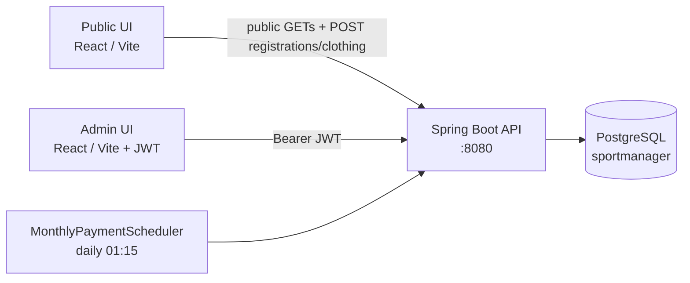
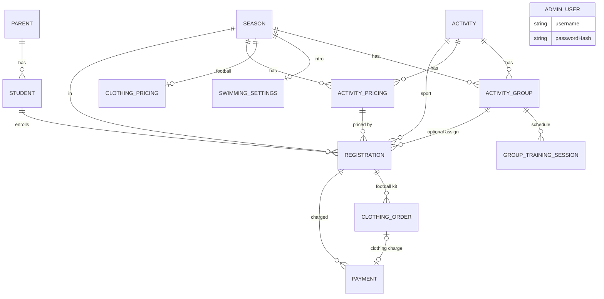
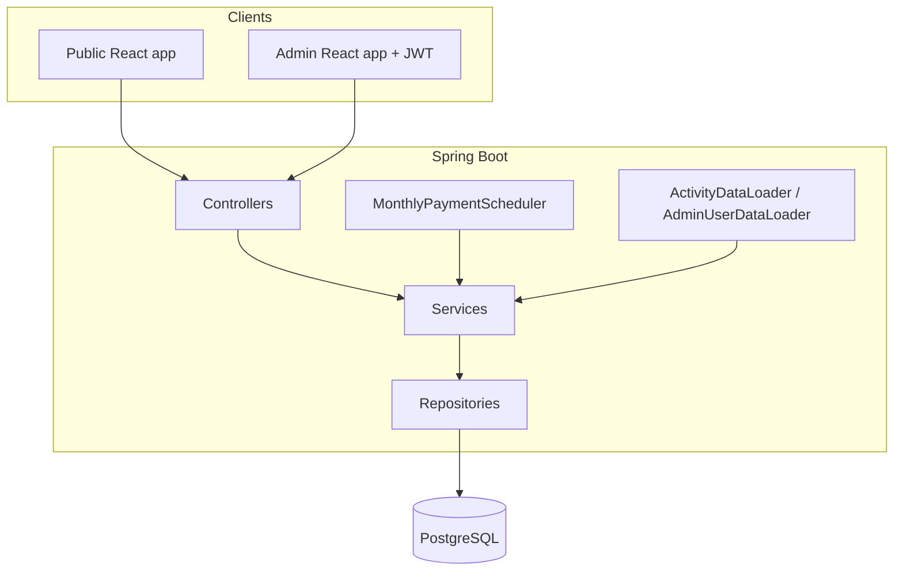
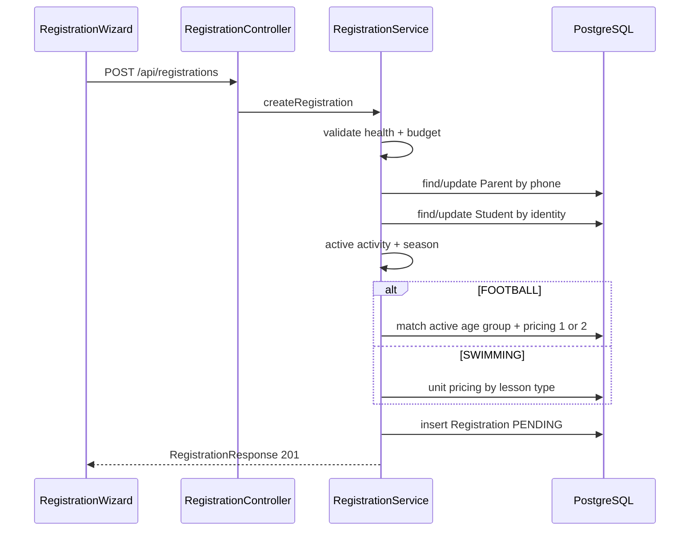
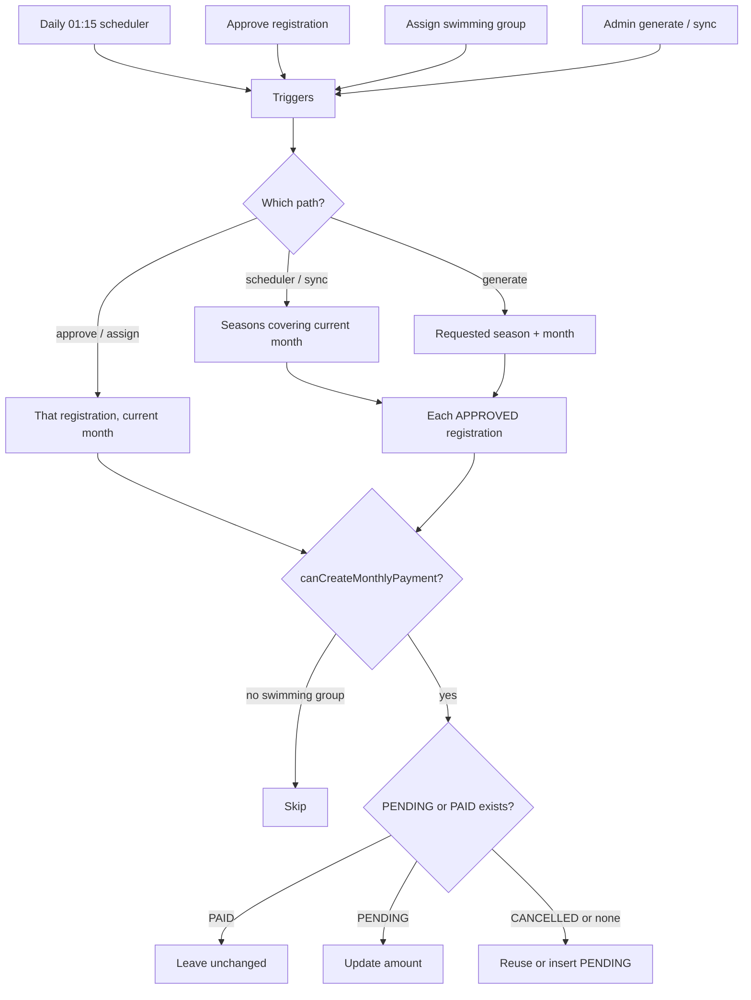
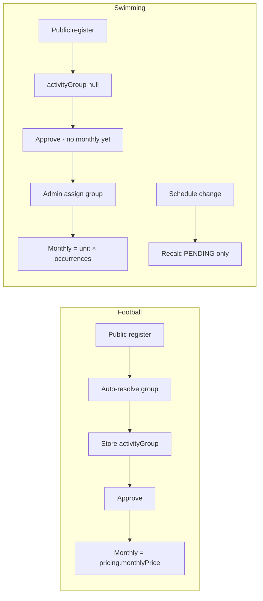

# SportManager System Architecture

This document describes the **current implementation** of SportManager, based on the source in `frontend/` and `backend/`. It is written for a developer who has never seen the project.

Where the code does not declare an order, timezone, or unique index, that is stated explicitly rather than guessed.

---

## Table of contents

1. [System overview](#1-system-overview)
2. [Technology stack](#2-technology-stack)
3. [Project structure](#3-project-structure)
4. [Full frontend-to-backend flow](#4-full-frontend-to-backend-flow)
5. [Registration flow](#5-registration-flow)
6. [Parent and student model](#6-parent-and-student-model)
7. [Activities](#7-activities)
8. [Seasons](#8-seasons)
9. [Groups and training sessions](#9-groups-and-training-sessions)
10. [Pricing](#10-pricing)
11. [Payments](#11-payments)
12. [Automatic payment generation](#12-automatic-payment-generation)
13. [Automatic processes and startup behavior](#13-automatic-processes-and-startup-behavior)
14. [Clothing orders](#14-clothing-orders)
15. [Kibbutz budget and Excel export](#15-kibbutz-budget-and-excel-export)
16. [Admin dashboard](#16-admin-dashboard)
17. [Admin screens](#17-admin-screens)
18. [Public registration UI](#18-public-registration-ui)
19. [Authentication and security](#19-authentication-and-security)
20. [Database model](#20-database-model)
21. [Important enums](#21-important-enums)
22. [API overview](#22-api-overview)
23. [Detailed end-to-end examples](#23-detailed-end-to-end-examples)
24. [Error handling and validation](#24-error-handling-and-validation)
25. [Data lifecycle](#25-data-lifecycle)
26. [Things that are NOT automatic](#26-things-that-are-not-automatic)
27. [Important business rules](#27-important-business-rules)
28. [Potentially surprising behavior](#28-potentially-surprising-behavior)
29. [Mermaid diagrams](#29-mermaid-diagrams)
30. [Source references](#30-source-references)
31. [System in 10 Minutes](#system-in-10-minutes)

---

## 1. System overview

### What SportManager does

SportManager is a management system for **football** and **swimming** activities. It supports:

- Public parent registration for a child (student)
- Admin review and approval of registrations
- Assignment of students to training groups
- Monthly activity billing and clothing billing
- Kibbutz-budget Excel export for accounting
- Football clothing (kit) orders after an approved football registration

The UI language is **Hebrew (RTL)**. API enum values stay in English.

### Main users

| User | How they access the system |
|------|----------------------------|
| **Parent / public visitor** | No login. Uses the public site at `/`, `/register/football`, `/register/swimming`, `/register/clothing`. |
| **Admin** | JWT login at `/admin/login`. Manages seasons, pricing, registrations, groups, payments, reports, and Kibbutz export. |

There is no parent/student login. There is a single admin role (`ROLE_ADMIN`). The backend does not distinguish multiple admin permission levels.

### Main business areas

1. **Catalog setup** — activities (FOOTBALL / SWIMMING), seasons, groups, training sessions, activity pricing, clothing pricing, swimming intro text.
2. **Registration** — parent + student upsert, one registration per student + activity + season.
3. **Approval & grouping** — admin approves; football is auto-assigned to an age-matching group at registration time; swimming is assigned later by an admin.
4. **Billing** — monthly activity payments, clothing payments, optional one-time manual payments.
5. **Kibbutz export** — Excel of pending kibbutz-budget charges for a charge month.
6. **Clothing** — football-only kit orders tied to an approved football registration.

### High-level architecture

The system is a **SPA + REST API**:

- **Frontend:** React 19 + Vite + TypeScript, talking to the API with `fetch`.
- **Backend:** Spring Boot 3.5.4 REST API.
- **Database:** PostgreSQL, mapped with Spring Data JPA / Hibernate (`ddl-auto=update`).



---

## 2. Technology stack

### Frontend

| Technology | Where / version |
|------------|-----------------|
| React | `^19.1.0` (`frontend/package.json`) |
| React DOM | `^19.1.0` |
| react-router-dom | `^7.18.1` |
| TypeScript | `~5.8.3` |
| Vite | `^6.3.5`, plugin `@vitejs/plugin-react ^4.4.1` |
| ESLint | `^9.25.0` with React hooks / refresh plugins |

There is **no** axios, UI kit, or i18n library. HTTP is a custom `fetch` wrapper (`frontend/src/api/client.ts`). Copy lives in `frontend/src/i18n/he.ts` and is accessed with `t()`.

Dev server: Vite on **port 5173** (`strictPort: true` in `frontend/vite.config.ts`).

API base URL: `VITE_API_BASE_URL` via `frontend/src/config.ts` (required; trailing slashes stripped).

### Backend

| Technology | Where / version |
|------------|-----------------|
| Java | 21 (`backend/pom.xml`) |
| Spring Boot | 3.5.4 |
| Spring Web | `spring-boot-starter-web` |
| Spring Data JPA | `spring-boot-starter-data-jpa` |
| Spring Validation | `spring-boot-starter-validation` |
| Spring Security | `spring-boot-starter-security` |
| Lombok | optional compile |
| PostgreSQL JDBC | runtime |
| JJWT | `0.12.6` (api / impl / jackson) |
| Apache POI OOXML | `5.4.1` (Kibbutz Excel) |

Entry point: `SportManagerApplication.java` (`@SpringBootApplication` + `@EnableScheduling`).

Default API: `http://localhost:8080`.

### Database

- **PostgreSQL**
- Default JDBC URL: `jdbc:postgresql://localhost:5432/sportmanager`
- Hibernate `ddl-auto` default: `update` (`JPA_DDL_AUTO`)
- Schema is evolved by Hibernate from JPA entities; there is also a one-time SQL migrator for legacy water-adaptation columns (`WaterAdaptationLevelsMigrator`)

Config: `backend/src/main/resources/application.properties`. Secrets come from env vars and/or gitignored `application-local.properties` (profile `local` by default).

### Authentication / security

- Stateless JWT (HS256), secret `app.jwt.secret` / `JWT_SECRET` (**at least 32 characters**)
- Default expiration: `86400000` ms (24 hours)
- Passwords hashed with **BCrypt** (`SecurityConfig.passwordEncoder`)
- CORS from `app.cors.allowed-origins` (default `http://localhost:5173,http://localhost:3000`)
- CSRF disabled; session policy `STATELESS`

Classes: `SecurityConfig`, `JwtService`, `JwtAuthenticationFilter`, `AdminUserDetailsService`, `AuthService`, `CorsConfig`.

### Build tools

| Area | Tool |
|------|------|
| Backend | Maven wrapper (`backend/mvnw`, `backend/mvnw.cmd`) — `./mvnw spring-boot:run` |
| Frontend | npm — `npm run dev` / `npm run build` (`tsc -b && vite build`) |

### Libraries that matter to the system

| Library | Why it matters |
|---------|----------------|
| Spring Security + JJWT | Admin login and protected endpoints |
| Spring Data JPA | All persistence |
| Hibernate `ddl-auto=update` | Creates/updates tables from entities |
| Apache POI XSSF | `.xlsx` Kibbutz export with RTL |
| React Router | Public vs admin routes, `RequireAuth` |
| Custom `t()` + `he.ts` | All Hebrew UI strings |

---

## 3. Project structure

Do not treat this as a full file listing. These are the pieces that explain how the system works.

```
SportManager/
  backend/          Spring Boot API
  frontend/         React SPA
  docs/             Plans, specs, and this architecture file
  README.md         Setup and high-level usage
```

### Frontend (`frontend/src/`)

| Path | Role |
|------|------|
| `main.tsx` | Mounts `AuthProvider` → `App` |
| `App.tsx` | Renders `AppRouter` |
| `routes/index.tsx` | All routes; `/admin/*` wrapped in `RequireAuth` |
| `config.ts` | `VITE_API_BASE_URL` |
| `api/client.ts` | Shared `fetch`, Bearer token, 401 session clear |
| `api/*.ts` | One module per domain (registrations, payments, catalogs, …) |
| `auth/` | `AuthContext`, `RequireAuth`, `tokenStorage`, `authEvents` |
| `pages/public/` | Football / swimming / clothing / health declaration |
| `pages/admin/` | Dashboard, registrations, payments, groups, seasons, pricing, export |
| `components/registration/` | `RegistrationWizard`, catalog hook, steps, form mapping |
| `components/admin/` | Group form, training-session editor |
| `i18n/he.ts`, `i18n/t.ts`, `i18n/labels.ts` | Hebrew copy and enum labels |
| `validation/fields.ts` | Israeli ID checksum, Israeli mobile, text helpers |
| `types/enums.ts` | Frontend copies of backend enum string values |
| `index.css` | Shared design tokens and layout |

Unused / redirected:

- `pages/admin/ActivitiesPage.tsx` exists, but `/admin/activities` **redirects to** `/admin/seasons`.
- `pages/AdminHomePage.tsx` re-exports `DashboardPage` and is not used by the router.
- `RegistrationCommonFields.tsx` and `SwimmingRegistrationFields.tsx` are legacy; the wizard uses `steps/` instead.

There are **no** dedicated admin pages for Parent or Student. Those APIs exist on the backend (`ParentController`, `StudentController`) but the current UI edits parent/student data through registration detail.

### Backend (`backend/src/main/java/com/sportmanager/`)

| Package / class | Role |
|-----------------|------|
| `SportManagerApplication` | Boot + `@EnableScheduling` |
| `HealthController` | `GET /api/health` |
| `controller/` | REST endpoints |
| `service/` | Business logic |
| `repository/` | Spring Data JPA |
| `entity/` | Tables |
| `enums/` | Domain enums |
| `dto/request`, `dto/response` | API contracts |
| `config/SecurityConfig` | Public vs authenticated routes |
| `config/CorsConfig` | CORS |
| `config/ActivityDataLoader` | Seeds FOOTBALL + SWIMMING activities |
| `config/AdminUserDataLoader` | Seeds default admin if missing |
| `config/WaterAdaptationLevelsMigrator` | Copies legacy single water level into the set table |
| `security/JwtService`, `JwtAuthenticationFilter`, `AdminUserDetailsService` | JWT |
| `scheduling/MonthlyPaymentScheduler` | Daily monthly-payment job |
| `exception/GlobalExceptionHandler` | HTTP error mapping |

There is **no** `GroupTrainingSessionRepository`. Sessions are owned by `ActivityGroup.trainingSessions` (`cascade = ALL`, `orphanRemoval = true`).

### Docs (`docs/`)

| Path | Role |
|------|------|
| `docs/SYSTEM_ARCHITECTURE.md` | This file (current implementation) |
| `docs/superpowers/plans/` | Historical implementation plans |
| `docs/superpowers/specs/` | Historical design specs |

Plans/specs may be outdated relative to the code. Prefer this architecture file and the source.

---

## 4. Full frontend-to-backend flow

A typical user action follows this path:

**UI page/component → `frontend/src/api/*.ts` → HTTP → controller → service → repository → PostgreSQL → response DTO → UI state update**

Auth: `frontend/src/api/client.ts` attaches `Authorization: Bearer <token>` when `localStorage` has `sportmanager.accessToken`. Public flows still use the same client; they simply do not need a token.

### Major flows

#### A. Public football / swimming registration

| Step | What happens |
|------|----------------|
| UI | `FootballRegistrationPage` / `SwimmingRegistrationPage` → `RegistrationWizard` |
| Catalog load | `useRegistrationCatalog` → `getActiveSeason`, `listActiveActivities`, then `getFootballCatalog` or `getSwimmingCatalog` |
| HTTP | `GET /api/seasons/active/{FOOTBALL\|SWIMMING}`, `GET /api/activities/active`, `GET /api/public/football-catalog` or `GET /api/public/swimming-catalog` |
| Controllers | `SeasonController`, `ActivityController`, `PublicFootballCatalogController` / `PublicSwimmingCatalogController` |
| Services | `SeasonService.requireActiveSeasonEntity`, `ActivityService.getActiveActivities`, `FootballCatalogService` / `SwimmingCatalogService` |
| Submit UI | Health step → `createRegistration(toRegistrationRequest(...))` |
| HTTP | `POST /api/registrations` |
| Controller | `RegistrationController.createRegistration` |
| Service | `RegistrationService.createRegistration` |
| Repositories | `ParentRepository`, `StudentRepository`, `ActivityRepository`, `SeasonRepository`, `ActivityGroupRepository`, `ActivityPricingRepository`, `RegistrationRepository` |
| DB | Upsert parent, upsert student, insert registration (`PENDING`) |
| DTO | `RegistrationResponse` (`201`) |
| UI | Wizard “done” step with status badge |

#### B. Admin login

| Step | What happens |
|------|----------------|
| UI | `LoginPage` → `useAuth().login` |
| API | `frontend/src/api/auth.ts` `login()` |
| HTTP | `POST /api/auth/login` |
| Controller | `AuthController.login` |
| Service | `AuthService.login` → `AuthenticationManager` + `JwtService.generateToken` |
| DB | `AdminUserRepository.findByUsername` (via `AdminUserDetailsService`) |
| DTO | `AuthResponse` (`accessToken`, `tokenType=Bearer`, `expiresInMs`, `username`) |
| UI | `tokenStorage.setSession` → navigate `/admin` |

#### C. Approve a registration

| Step | What happens |
|------|----------------|
| UI | `RegistrationsPage` or `RegistrationDetailPage` |
| API | `approveRegistration(id)` in `frontend/src/api/registrations.ts` |
| HTTP | `PATCH /api/registrations/{id}/approve` |
| Controller | `RegistrationController.approveRegistration` |
| Service | `RegistrationService.approveRegistration` then `PaymentService.ensureSeasonMonthlyPayments` |
| DB | Registration `status=APPROVED`; may insert/update current-month `MONTHLY_ACTIVITY` payment |
| DTO | `RegistrationResponse` |
| UI | List/detail refresh |

#### D. Assign a swimming student to a group

| Step | What happens |
|------|----------------|
| UI | `ActivityGroupDetailPage` eligible list |
| API | `assignRegistrationToGroup` in `frontend/src/api/activityGroups.ts` |
| HTTP | `POST /api/activity-groups/{groupId}/registrations/{registrationId}` |
| Controller | `ActivityGroupController.assignRegistration` |
| Service | `ActivityGroupService.assignRegistrationToGroup` then, if swimming + APPROVED, `PaymentService.ensureOrUpdatePendingMonthlyPayment` |
| DB | `registrations.activity_group_id` set; pending monthly payment created/updated |
| DTO | `RegistrationResponse` |

#### E. Confirm a payment

| Step | What happens |
|------|----------------|
| UI | `PaymentDetailPage` |
| API | `confirmPayment` in `frontend/src/api/payments.ts` |
| HTTP | `PATCH /api/payments/{paymentId}/confirm` |
| Controller | `PaymentController.confirmPayment` |
| Service | `PaymentService.confirmPayment` |
| DB | `status=PAID`, `paymentDate=today`, method BIT/PAYBOX or forced `KIBBUTZ_BUDGET` |
| DTO | `PaymentResponse` |

#### F. Kibbutz Excel download

| Step | What happens |
|------|----------------|
| UI | `KibbutzExportPage` |
| API | `downloadKibbutzExport` / `downloadKibbutzClothingExport` (`apiDownload` in `client.ts`) |
| HTTP | `GET /api/exports/kibbutz?year=&month=&activityType=` or `GET /api/exports/kibbutz/clothing?year=&month=` |
| Controller | `KibbutzExportController` |
| Service | `KibbutzExportService` + `PaymentRepository` JPQL |
| Result | `.xlsx` bytes, `Content-Disposition` attachment |

#### G. Public clothing order

| Step | What happens |
|------|----------------|
| UI | `ClothingOrderPage` |
| Catalog | `GET /api/public/clothing-catalog` |
| Eligibility | `GET /api/public/clothing-eligibility?seasonId=&studentIdentityNumber=` |
| Submit | `POST /api/clothing-orders` |
| Services | `ClothingCatalogService`, `ClothingOrderService`, then `PaymentService.ensureClothingPayment` (unless already-has) |
| DB | `clothing_orders` row; optional `payments` row (`CLOTHING`, `PENDING`) |
| DTO | `ClothingOrderResponse` |

---

## 5. Registration flow

Public create is **one endpoint** for both sports:

`POST /api/registrations` → `RegistrationController.createRegistration` → `RegistrationService.createRegistration(RegistrationRequest)`

Status on create: **`PENDING`**. Payments are **not** created here.

### Ordered steps inside `createRegistration`

1. `validateRegistrationRequest` — health declaration + kibbutz budget
2. `getOrCreateParent`
3. `getOrCreateStudent`
4. `getActiveActivity`
5. `getActiveSeason`
6. `validateActivitySpecificFields`
7. `validateRegistrationDoesNotExist`
8. Resolve group + pricing (football vs swimming)
9. `buildRegistration` → `registrationRepository.save`
10. `toResponse`

### Football vs swimming

| Concern | Football | Swimming |
|---------|----------|----------|
| Extra request fields | Must all be **null** (`swimmingLessonType`, `waterAdaptationLevel`, `weeklySessions`) | `swimmingLessonType` required; `waterAdaptationLevel` required; `weeklySessions` 1–6 unless `GROUP` |
| Group at create | Auto-resolved and **stored** on the registration | `activityGroup = null` |
| Pricing row | Season + activity + weeklySessions = count of **active training slots** on the matched group (must be 1 or 2) | Season + activity + lesson type + `weeklySessions = 1` (unit price) |
| Stored `weeklySessions` on registration | Active session count of the matched group | `GROUP` → admin setting (default 2); otherwise request value |

### Parent lookup / create / update

`RegistrationService.getOrCreateParent`

- Lookup: `parentRepository.findByPhoneNumber(request.getPhoneNumber())`
- If missing: `new Parent()`
- **Always overwrites** first name, last name, phone, kibbutz flag, budget
- Non-kibbutz: `budgetNumber = null`
- Save: `parentRepository.save`

Identity key: **phone number** (`uk_parents_phone_number`).

Public create does **not** trim names/phone (admin update does trim). Frontend `toRegistrationRequest` already normalizes phone and trims names before send.

### Student lookup / create / update

`RegistrationService.getOrCreateStudent`

- Lookup: `studentRepository.findByIdentityNumber(request.getStudentIdentityNumber())`
- If missing: `new Student()`
- If existing student belongs to a **different parent id**: `BusinessRuleException("Student identity number is associated with another parent")`
- **Always overwrites** identity number, first name, last name, age, age group, gender, parent
- Save: `studentRepository.save`

Identity key: **`identity_number` unique**.

Backend does **not** validate Israeli ID checksum. The public wizard does (`isValidIsraeliId` in `frontend/src/validation/fields.ts`).

### Identity number handling

- Request field: `studentIdentityNumber` (`@NotBlank`)
- Frontend pads to 9 digits and validates checksum before submit
- Backend stores the string as sent
- Existing identity:
  - same parent → student row updated, then duplicate-registration check
  - different parent → hard error, no registration created

### Duplicate registration validation

`RegistrationService.validateRegistrationDoesNotExist` uses:

`registrationRepository.existsByStudentAndActivityAndSeason(student, activity, season)`

If true → `ConflictException("Student is already registered to this activity in this season")`

DB unique constraint: `uk_registration_student_activity_season` on `(student_id, activity_id, season_id)`.

**Status is not part of the key.** A `CANCELLED` row still occupies the unique slot, so a new public registration for the same student + activity + season will fail.

A student **can** register for football and swimming in the same season (different `activity_id`), or the same activity in a **different** season.

### Season validation

`getActiveSeason`:

- Season must exist
- `season.isActive` must be `true` — otherwise `"Registrations can only be created for an active season"`
- If `season.activityType != null` and it does not match the activity’s type — `"Season activity type does not match the selected activity"`
- **`startDate` / `endDate` are not used** to accept or reject registration

### Activity validation

`getActiveActivity`:

- Must exist
- `activity.isActive` must be `true` — `"Registrations can only be created for an active activity"`

Startup forces both activity types to exist and be active (`ActivityDataLoader`). Deactivate is still possible via API; if an activity is inactive, public registration for that type fails.

### Health declaration validation

- DTO: `healthDeclarationApproved` `@NotNull`
- Service: must be `Boolean.TRUE`, else `"Health declaration must be approved to complete registration"`
- `hasMedicalLimitation` is required on the DTO but not further validated; stored as-is
- `medicalNotes` / `specialRequests` optional

The public UI also requires checking the declaration (`HealthStep` / `HealthDeclarationApproval`). The full text is a separate public page `/register/health-declaration`.

### Kibbutz / budget logic

If `isKibbutzMember == true`:

- Budget required (non-blank)
- Must match `\\d+` (digits only)

Messages:

- `"Budget number is required for a kibbutz member"`
- `"Budget number must contain only whole numbers"`

If not kibbutz: parent `budgetNumber` is set to `null`.

Kibbutz membership later drives default payment method `KIBBUTZ_BUDGET` (`PaymentService.determineDefaultPaymentMethod`).

### Age / age-group logic

- Request requires `age` (`@Positive`) and `ageGroup` (`AgeGroup` enum)
- **No backend check** that numeric age matches `AgeGroup`
- Football: `request.getAgeGroup()` must match **exactly one** active group whose `ageGroups` set contains that value (`resolveFootballGroup`)
- Public swimming UI only offers kindergarten groups (`SWIMMING_AGE_GROUPS` in `frontend/src/types/enums.ts`). The backend still accepts any `AgeGroup` enum value.

Football group match extra rules:

- 0 matches → `"No active football group matches this age group for the selected season"`
- >1 matches → `"Multiple active football groups match this age group; fix admin configuration"`
- Matched group must have **1 or 2 active training sessions**

### Swimming-specific fields

Validated in `validateActivitySpecificFields`:

- `swimmingLessonType` required
- `waterAdaptationLevel` required
- If lesson type is **not** `GROUP`: `weeklySessions` must be 1–6
- If `GROUP`: request weekly sessions are **ignored**; later `resolveSwimmingWeeklySessions` uses `SwimmingRegistrationSettingsService.resolveGroupWeeklySessions(seasonId)` (default **2** if no settings row)

Values:

- `SwimmingLessonType`: `PRIVATE`, `PAIR`, `GROUP`
- `WaterAdaptationLevel`: `NOT_INDEPENDENT`, `INDEPENDENT_NO_HEAD`, `INDEPENDENT_WITH_HEAD`, `BASIC_SWIMMING`

### Pricing resolution

**Football:** `resolveFootballPricing` → `findBySeasonAndActivityAndWeeklySessions(season, activity, weeklySessions)` where `weeklySessions` is the active training-slot count (1 or 2). Missing row → `"Football pricing was not found for N weekly sessions…"`.

**Swimming:** `getSwimmingPricing` → `findBySeasonAndActivityAndSwimmingLessonTypeAndWeeklySessions(..., lessonType, 1)`. Missing → `"Swimming unit pricing was not found for this lesson type"`.

The registration always stores a required `activityPricing` FK.

### Registration status

Created as `RegistrationStatus.PENDING`.

Admin:

- `PATCH /api/registrations/{id}/approve` → `APPROVED` + `PaymentService.ensureSeasonMonthlyPayments`. Allowed from `PENDING` **or** `CANCELLED`. Already `APPROVED` → `ConflictException("Registration is already approved")`.
- `PATCH /api/registrations/{id}/cancel` → `CANCELLED`, `activityGroup = null`, cancel **pending monthly** payments only. Already `CANCELLED` → `ConflictException("Registration is already cancelled")`.
- Re-approving a cancelled registration does **not** restore the group. Football billing can still run without a group (`canCreateMonthlyPayment` is true for football). The admin UI (`RegistrationsPage`, `RegistrationDetailPage`) exposes this as a restore/approve action on cancelled rows.

### Database records created or updated

| Entity | Behavior on public register |
|--------|-----------------------------|
| `Parent` | Insert or update by phone |
| `Student` | Insert or update by identity number |
| `Registration` | **Insert only** |
| `Payment` | Not created |
| `ClothingOrder` | Not created |

### What happens if an existing identity number is submitted again

| Scenario | Result |
|----------|--------|
| Same identity, **same** parent (phone resolves to that parent), **same** activity + season | Parent and student fields are updated **first**, then `ConflictException` duplicate registration |
| Same identity, same parent, **different** activity and/or season | Parent/student updated; new registration if other validations pass |
| Same identity, **different** parent (different phone → different parent row) | `BusinessRuleException("Student identity number is associated with another parent")` — student is **not** re-parented |
| Same phone, different identity | Existing parent updated in place; new or existing student by identity |

Parent name / kibbutz / budget are overwritten whenever the phone matches, even if the later registration insert fails.

### Error cases (create path)

| HTTP (via `GlobalExceptionHandler`) | Exception | Typical message |
|-------------------------------------|-----------|-----------------|
| 400 | `BusinessRuleException` | Health declaration, budget, parent mismatch, inactive season/activity, swimming/football field rules, football group/pricing problems |
| 400 | Bean validation | Missing names, age, ids, etc. (`RegistrationRequest`) |
| 404 | `ResourceNotFoundException` | Activity/season not found; swimming unit pricing not found |
| 409 | `ConflictException` | Student already registered to this activity in this season |

### Admin update of a registration

`PUT /api/registrations/{id}` → `RegistrationService.updateRegistrationAdmin`

- Updates parent (trimmed) and student (does **not** change identity number or parent link)
- Parent phone is written **without** `existsByPhoneNumberAndIdNot`. A clash with another parent hits the DB unique index and is not mapped to `ConflictException` (see §24).
- Re-resolves football group/pricing from the new age group (skipped when status is `CANCELLED`: group forced to null)
- For football, sets `weeklySessions` on the registration to **null** (unlike create, which stores the session count). `toResponse` then falls back to `activityPricing.weeklySessions`, so the API may still show 1 or 2.
- For swimming, updates lesson type / water level / weekly sessions and unit pricing
- If swimming + APPROVED + already has a group → `ensureOrUpdatePendingMonthlyPayment`

---

## 6. Parent and student model

### Relationship

- `Parent` 1 → * `Student` (`students.parent_id` not null)
- `Student` 1 → * `Registration`
- A student has exactly one parent at a time

There is no many-to-many. Two children of the same household share a parent **only if they are registered with the same phone number**.

### Unique identifiers

| Entity | Business key | DB |
|--------|--------------|----|
| Parent | Phone number | `uk_parents_phone_number` / `phone_number` unique |
| Student | Identity number | `students.identity_number` unique |
| Registration | Student + activity + season | `uk_registration_student_activity_season` |

### How existing records are found

- Public registration: parent by **exact phone string** as stored; student by **exact identity string** as stored
- Students are **not** matched by name. `StudentRepository.findByParentAndFirstNameAndLastName` exists but is unused.
- Admin: `ParentService.getParents(search, isKibbutzMember)` ILIKE on name/phone; `StudentService.getStudents(search, ageGroup, parentId)`; `GET /api/students/identity/{identityNumber}`

Frontend public clothing eligibility also looks up student by identity (`ClothingCatalogService.checkEligibility`).

### When data is updated

| Event | Parent | Student |
|-------|--------|---------|
| Public `POST /api/registrations` | Always overwrite fields for matching phone | Always overwrite fields for matching identity (if same parent) |
| Admin `PUT /api/registrations/{id}` | Overwrite name, phone, kibbutz, budget | Overwrite name, age, age group, gender (not identity) |
| Admin `PUT /api/parents/{id}` | Overwrite; phone uniqueness checked against others | — |
| Admin `PUT /api/students/{id}` | — | Overwrite including identity; uniqueness checked against others |

### Phone number already exists

- **Public registration:** treated as the same parent; fields updated in place. No conflict error for the phone itself.
- **Admin `PUT /api/parents/{id}`:** `existsByPhoneNumberAndIdNot` → `ConflictException("Another parent already exists with this phone number")`
- **Admin `PUT /api/registrations/{id}`:** no phone uniqueness check in `updateRegistrationAdmin`; a duplicate phone relies on the DB unique index

### Identity number already exists

- **Public registration:** same parent → update; other parent → business-rule error
- **Admin student update:** `existsByIdentityNumberAndIdNot` → `ConflictException("Another student already exists with this identity number")`

### Important constraints

- Parent phone unique
- Student identity unique
- Student must have a parent
- Kibbutz member requires numeric budget (enforced in registration and parent update, not by a DB check)
- Backend does not enforce Israeli phone/ID format; the public wizard does

---

## 7. Activities

Entity: `Activity` (`activities`) — `activityType` (`FOOTBALL` \| `SWIMMING`), `isActive`.

There is **no JPA unique constraint** on `activity_type`. Uniqueness is enforced in `ActivityService` (`existsByActivityType` / `existsByActivityTypeAndIdNot`). Hibernate `ddl-auto=update` will not create a unique index from this mapping. A database created outside this entity (manual SQL) could still have an extra index; that is not declared in the current code.

### Startup creation

`ActivityDataLoader` (`CommandLineRunner`) → `ActivityService.ensureDefaultActivities()`:

For each `ActivityType.values()`:

- If missing → insert with `isActive=true`
- If present but inactive → set `isActive=true` and save

So after every successful startup, both sports exist and are active **unless something deactivates them later in the same process**.

### Why activities are “always active” on create/update

`ActivityRequest` requires `isActive` (`@NotNull`), but `ActivityService.createActivity` and `updateActivity` **ignore** that field and set `isActive=true`.

Explicit deactivate: `PATCH /api/activities/{id}/deactivate`.

The public catalog still checks `activity.isActive` (`FootballCatalogService`, `SwimmingCatalogService`, `RegistrationService.getActiveActivity`).

### Difference from seasons

| | Activity | Season |
|--|----------|--------|
| Meaning | Global sport type (normally one row per type) | Time-bounded offering for one sport |
| Dates | None | `startDate`, `endDate` |
| How many | Service: one per `ActivityType` | Many; at most one **active** per `ActivityType` |
| Opens public registration? | Must be active | Must be active (flag, not dates) |
| Created on startup? | Yes | **No** — admin creates seasons |

### Where activity validation is still used internally

- Registration create: activity must exist and be active
- Catalogs: football/swimming activity must exist and be active
- Clothing: football activity must exist (`ClothingOrderService.getFootballActivity`)
- Groups: activity resolved by type (`ActivityGroupService.getActivity`)
- Pricing: activity resolved by type (`ActivityPricingService.getActivity`)
- Season vs activity type must match when creating pricing or registering

The current admin UI does not expose a dedicated activities screen (`/admin/activities` redirects to seasons). Activities are still a real backend resource.

---

## 8. Seasons

Entity: `Season` (`seasons`) — unique `name`, `startDate`, `endDate`, `activityType`, `isActive`.

### How seasons work

A season is the billing/registration container for **one sport**. Groups, activity pricing, clothing pricing (football), and swimming registration settings all hang off `season_id`.

Registrations store `season_id`. Duplicate registration is per season.

### Sport-specific seasons

`activityType` is required on `SeasonRequest`.

Active lookup used by public catalogs:

`SeasonRepository.findFirstByIsActiveAndActivityType(true, activityType)`

Creating or activating an active season calls `SeasonService.deactivateActiveSeasonsOfType`, so **at most one active season per sport**.

Football and swimming can both have an active season at the same time.

### Active / inactive behavior

- `isActive=true` → public registration and public catalogs for that sport use this season
- `isActive=false` → cannot create new registrations for it; existing rows remain
- Deactivating does **not** cancel registrations or payments
- The daily payment scheduler still bills seasons whose **dates cover the current month**, including inactive ones (see [§12](#12-automatic-payment-generation))

### Opening and closing registration

There is **no** `registrationOpen` flag.

Backend “open for registration” = `season.isActive == true` (`RegistrationService.getActiveSeason`).

Dates are validated (`endDate` after `startDate`, not equal) and used for **payment month coverage** (`PaymentService.seasonCoversMonth`), not for accepting registrations.

An admin can keep a season active after `endDate`; the API will still accept registrations. Conversely, an inactive season inside its date range will **not** accept public registrations.

### Database rules

- `seasons.name` unique (column + `existsByName` / `existsByNameAndIdNot`)
- No DB unique on `(activityType, isActive)`; “one active per sport” is service-level

### How season selection affects other parts

| Area | Effect |
|------|--------|
| Public football/swimming/clothing catalogs | Bind to the active season of that sport |
| Groups / pricing / swimming settings | Keyed by `season_id` |
| Registrations list / dashboard / reports | Filtered by selected season |
| Payments generate | Requires `seasonId` in practice (`PaymentService.resolveSeason(null)` throws) |
| Payments sync with null seasonId | All currently **active** seasons, current calendar month only |
| Clothing pricing | One row per season; create allowed only for football seasons |
| Duplicate registration | Includes season |

---

## 9. Groups and training sessions

Classes: `ActivityGroup`, `GroupTrainingSession`, `ActivityGroupService`, `ActivityGroupController`.

### ActivityGroup

Table `activity_groups`. Unique: `uk_activity_group_season_activity_name` on `(season_id, activity_id, name)`.

Important fields:

- `name`, `season`, `activity`, `isActive` (default true)
- `ageGroups` — element collection → `activity_group_age_groups`
- `swimmingLessonType`
- `waterAdaptationLevels` — element collection → `activity_group_water_adaptation_levels`
- `weeklySessions`
- `trainingSessions` (cascade all, orphan removal)
- `registrations` (inverse of `Registration.activityGroup`)

Requests still accept a legacy single `waterAdaptationLevel`; `resolveWaterAdaptationLevels` promotes it to a one-element set.

### GroupTrainingSession

Table `group_training_sessions`. Unique: `uk_group_training_session_day_start` on `(activity_group_id, day_of_week, start_time)`.

Fields: `dayOfWeek` (`java.time.DayOfWeek`), `startTime` (required), `endTime` (optional), `isActive` (default true).

No dedicated repository.

### Football groups vs swimming groups

| | Football | Swimming |
|--|----------|----------|
| Age groups | Required ≥1; **no overlap** across **active** groups in same season+activity | Required ≥1; overlap allowed |
| Lesson type / water | Must be empty/null | Lesson type required; ≥1 water level |
| `weeklySessions` | Derived from **active** training slots (1 or 2) | Explicit 1–6; when group is active, active session count must equal this |
| Capacity | `null` (unlimited in code) | PRIVATE=1, PAIR=2, GROUP=5 |
| Assigned at public register | Yes | No |
| Auto-assign on group save/activate | Yes (unassigned, not cancelled, age match) | **No** — admin only |
| Billing needs group | Price tier chosen at registration from session count; monthly amount is the pricing row as-is | Monthly amount needs assigned group + active training weekdays |

### Age groups

Enum `AgeGroup`: kindergarten (`OLD_GAN_HADAR`, `YOUNG_GAN_RIMON`, `OLD_GAN_RIMON`) plus `GRADE_1`…`GRADE_6`.

Football eligibility = student’s `ageGroup` ∈ group’s `ageGroups`.

Swimming group configuration stores age groups, but **assignment does not check them** (`isEligibleForGroup` returns `false` for non-football; the eligible-list filter then **skips** that check for swimming).

### Lesson types and water levels

Stored on swimming groups. Used for admin UI display and group validation on create/update.

**Not** used as a backend filter when assigning a registration to a swimming group (`validateCanAssign` only applies `isEligibleForGroup` for football).

### Weekly sessions

- Football: count of active `GroupTrainingSession` rows; must be 1 or 2 when the group is active. `healStaleFootballWeeklySessions` rewrites a stale column when groups are listed/fetched.
- Swimming: admin-chosen 1–6; must match the number of active slots when the group is active.

### Capacity

`ActivityGroupService.resolveMaxCapacity`:

- Football → `null` (no cap)
- Swimming PRIVATE → 1, PAIR → 2, GROUP → 5

`assignRegistrationToGroup` and football auto-assign both call `hasRemainingCapacity`. Football therefore never fills up by capacity.

Member count is `registrationRepository.findByActivityGroupId(groupId).size()` with **no status filter**. That still matches live membership because:

- `cancelRegistration` always sets `activityGroup = null`
- Manual assign requires `APPROVED`
- Football auto-assign skips `CANCELLED`

So cancelled rows are not members. **PENDING football** registrations that were auto-assigned **are** counted (football has no cap, so this does not block assignment).

### Student assignment

- `POST /api/activity-groups/{groupId}/registrations/{registrationId}`
  - Registration must be **APPROVED**
  - Group must be **active**
  - Same season and activity
  - Football: age eligibility
  - Capacity check
  - Swimming + APPROVED → `ensureOrUpdatePendingMonthlyPayment`
- `DELETE /api/activity-groups/registrations/{registrationId}` — sets `activityGroup=null`. **Does not** recalculate or cancel payments.
- Eligible list: APPROVED, same season+activity, `activityGroup == null`; football also age-filtered. Swimming eligible list does **not** filter lesson type, water level, age, or weekly sessions.

Football auto-assign (`autoAssignMatchingRegistrations`) includes **non-cancelled** unassigned registrations (PENDING and APPROVED), unlike manual assign which requires APPROVED. It does **not** create payments (the swimming payment branch in that method is unreachable because swimming returns earlier).

### Active / inactive

- Activate: re-validates sessions / football age overlap, sets `isActive=true`, then auto-assigns football matches
- Deactivate: `isActive=false` only; **does not** unassign members
- Delete: unassigns all members, then deletes group (sessions cascade)

### Schedule logic

Each session needs day + start time + `isActive`. Duplicate `(day, startTime)` in the same group is rejected.

Catalog and billing use **active** sessions only.

Football public catalog sorts days Sunday-first (`FootballCatalogService.israeliWeekDayOrder`).

### How group configuration affects billing

See [§10](#10-pricing) and [§11](#11-payments).

- **Football:** changing the group’s active slot count changes the **pricing tier used for new registrations**. Existing registrations keep the `activityPricing` row they were saved with unless an admin update re-resolves football pricing. Monthly football amount is that row’s `monthlyPrice` with **no** multiplication by session days.
- **Swimming:** updating a group (including sessions) calls `PaymentService.recalculatePendingMonthlyPaymentsForGroup`. Amount = unit `monthlyPrice` × count of active training **weekdays** occurring in the charge month, clipped to season dates and `registrationDate`. **PAID** rows are never changed.

---

## 10. Pricing

Admin API: `ActivityPricingController` (`/api/activity-pricing`), `ClothingPricingController` (`/api/clothing-pricing`).

Season type must match activity type (`ActivityPricingService.validateSeasonMatchesActivity`).

Column `monthly_price` is named historically. `ActivityPricing` comments call it a weekly rate; **actual billing is implemented in `PaymentService.resolveMonthlyAmount`**, not in those comments.

### Football pricing

- One row per `(season, activity, weeklySessions ∈ {1,2})`
- `swimmingLessonType` must be null
- Service uniqueness: `existsBySeasonAndActivityAndWeeklySessions`
- The JPA entity declares **no** `@UniqueConstraint`. Duplicate prevention is service-level only; `ddl-auto=update` will not add a unique index from this class.

**Resolution at registration:** count active training sessions on the matched age-group (1 or 2) → look up that `weeklySessions` row → store FK on the registration.

**Billing:** `amount = activityPricing.monthlyPrice` with no week or occurrence multiplication.

### Swimming pricing

- One unit row per `(season, activity, swimmingLessonType)` with `weeklySessions` **always stored as 1**
- Service uniqueness: `existsBySeasonAndActivityAndSwimmingLessonTypeAndWeeklySessions(..., 1)`
- Catalog (`SwimmingCatalogService`) prefers `weeklySessions == 1` per lesson type; if several rows exist, lowest session count otherwise

**Resolution at registration:** look up unit row for the chosen lesson type.

**Billing (after group assignment):** `amount = unit monthlyPrice × session occurrences in that calendar month`.

`Registration.weeklySessions` is stored (form frequency / GROUP settings) but **is not** the swimming billing multiplier in `PaymentService`.

### Clothing pricing

`ClothingPricingService`:

- Create only if `season.activityType == FOOTBALL`
- One row per season (`uk_clothing_pricing_season`)
- Short kit price always required > 0
- Long kit / hoodie: if public-disabled, stored price `0`; if enabled, price > 0
- Flags: `allowAlreadyHasClothingSkip`, `longKitPublicEnabled`, `hoodiePublicEnabled` (null treated as true when reading)

Get-by-season for edit **does not** re-apply the football-only gate, so an existing row can still be loaded.

**Charge:** `shortPrice×qty + longPrice×qty + hoodiePrice×qty` (`PaymentService.calculateClothingAmount`).

### Swimming registration settings

`SwimmingRegistrationSettingsService.create` does **not** require `season.activityType == SWIMMING`. Uniqueness is one settings row per `season_id` (`uk_swimming_registration_settings_season`), so a football season id is accepted if sent.

### Season / activity relationship

Pricing belongs to a season **and** an activity entity resolved by `ActivityType`. You cannot attach football prices to a swimming season.

### Group-related pricing rules

- Football group schedule selects the 1-session vs 2-session **price row** at registration time
- Swimming group **schedule** selects how many billable days occur in a month
- Swimming GROUP lesson frequency shown on the public form comes from `SwimmingRegistrationSettings.groupWeeklySessions` (default 2), not from a specific group

---

## 11. Payments

Core: `Payment` entity, `PaymentService`, `PaymentController` (`/api/payments`).

### Payment entity (`payments`)

| Field | Meaning |
|-------|---------|
| `registration` | Required FK |
| `amount` | `BigDecimal(10,2)` |
| `chargeMonth` | First day of the billed month (nullable at DB; set in service) |
| `status` | `PENDING` / `PAID` / `CANCELLED` |
| `paymentDate` | Set on confirm; cleared on cancel |
| `paymentMethod` | `BIT` / `PAYBOX` / `KIBBUTZ_BUDGET` |
| `paymentType` | `MONTHLY_ACTIVITY` / `CLOTHING` / `MANUAL_ONE_TIME` |
| `clothingOrder` | Optional unique FK for clothing charges |

Unique: `uk_monthly_payment` on `(registration_id, charge_month, payment_type)` — applies to **all** types, including clothing and manual, so at most one row per registration + month + type (including cancelled). Generate/upsert **reuse** a cancelled `MONTHLY_ACTIVITY` row. `createManualPayment` does not reuse cancelled manuals.

Also unique: `clothing_order_id`.

### PaymentStatus

| Value | Meaning |
|-------|---------|
| `PENDING` | Open charge; amount can be edited; can be confirmed or cancelled |
| `PAID` | Confirmed; amount frozen; cannot cancel |
| `CANCELLED` | Closed without payment; monthly row can be revived |

### PaymentMethod

| Value | When used |
|-------|-----------|
| `BIT` | Default for non-kibbutz new payments; allowed on confirm for non-kibbutz |
| `PAYBOX` | Allowed on confirm for non-kibbutz |
| `KIBBUTZ_BUDGET` | Default and forced-on-confirm if parent `isKibbutzMember` |

### PaymentType

| Value | How created |
|-------|-------------|
| `MONTHLY_ACTIVITY` | Generate / sync / scheduler / approve / swimming group assign / `POST /monthly` |
| `CLOTHING` | Clothing order create/update (`ensureClothingPayment`) or `POST /clothing` |
| `MANUAL_ONE_TIME` | `POST /api/payments/manual` (no current frontend caller) |

### Monthly payments

- `chargeMonth` normalized with `.withDayOfMonth(1)`
- Only for **APPROVED** registrations (`validateRegistrationApproved`)
- `POST /api/payments/monthly` (single create) does **not** call `seasonCoversMonth`; it will create a row for a month outside the season dates if the other checks pass
- Football: always `canCreateMonthlyPayment = true` (even if `activityGroup` is null)
- Swimming: requires assigned group with ≥1 active training weekday
- Amount ≤ 0 → skipped (not created) in generate/sync/upsert; single `createMonthlyPayment` still populates whatever `resolveMonthlyAmount` returns

### Clothing payments

Created when an order is placed and `alreadyHasClothing` is false. `chargeMonth` = current month 1st for new or reactivated cancelled rows; **not** reset if a PENDING row already exists. PAID clothing amounts are never changed.

### chargeMonth

Always stored as the first day of a month. List filters compare equality to that normalized date.

Clothing and manual use “today’s month”. Monthly generate uses the requested month. Scheduler/sync use the **current calendar month**.

### Uniqueness rules

1. DB unique `(registration, chargeMonth, paymentType)`
2. “Active monthly” = PENDING or PAID for that key (`hasActiveMonthlyPayment`)
3. If CANCELLED exists for that key, generate/create **reuses** the row
4. One clothing payment per clothing order
5. At most one `MANUAL_ONE_TIME` per registration per charge month. `createManualPayment` always inserts a **new** row and does **not** reuse a CANCELLED manual row, so a second insert can hit `uk_monthly_payment` as an unmapped persistence exception (see §24).

### PENDING / PAID / CANCELLED behavior

| Action | Rule |
|--------|------|
| Edit amount (`PATCH /{id}`) | PENDING only; amount > 0 |
| Confirm | Not PAID, not CANCELLED |
| Cancel single payment | Not CANCELLED; **PAID cannot be cancelled** |
| Recalc monthly amount | PENDING only; PAID never changed |
| Clothing refresh | PENDING amount updated; PAID returned as-is; CANCELLED reactivated to PENDING |
| Registration cancel | Cancels PENDING `MONTHLY_ACTIVITY` only — not clothing/manual |

### Confirmation

`PaymentService.confirmPayment`:

1. Reject if already PAID or CANCELLED
2. If parent is kibbutz member → force `KIBBUTZ_BUDGET` (request method ignored)
3. Else require `BIT` or `PAYBOX`
4. `status=PAID`, `paymentDate=LocalDate.now()`

### Cancellation

- Single: PENDING → CANCELLED, `paymentDate=null`
- Registration cancel → `cancelPendingMonthlyPayments`
- Clothing “already has” → `cancelPendingClothingPayment` (PENDING clothing only)

### Kibbutz budget payments

New payments for kibbutz parents default to `KIBBUTZ_BUDGET`. Confirm always sets that method for kibbutz members. Export requires PENDING + that method + `parent.isKibbutzMember = true`.

---

## 12. Automatic payment generation

This is the billing engine. All paths eventually share `generateMonthlyPaymentsForSeasonMonth` or `upsertPendingMonthlyPayment`.

### There **is** a scheduler

Class: `MonthlyPaymentScheduler`  
Cron: `"0 15 1 * * *"` — **every day at 01:15:00**. Spring uses the **JVM default timezone**. `application.properties` does not set a scheduler timezone or `spring.jackson.time-zone`.  
Method: `createCurrentMonthPayments()` → `PaymentService.generateCurrentMonthPaymentsForCoveringSeasons()`.

It is **not** “once on the 1st of the month only”; it runs daily and is written to be idempotent (“existing active payments are skipped”).

`@EnableScheduling` is on `SportManagerApplication`. No other `@Scheduled` jobs exist in the backend.

### What is generated automatically

| Trigger | What |
|---------|------|
| Daily 01:15 scheduler | Current calendar month `MONTHLY_ACTIVITY` PENDING for **APPROVED** registrations in **every season whose dates overlap that month** (active **or** inactive) |
| Registration **approve** | Current month only, if `seasonCoversMonth`; swimming skipped until a group exists |
| Swimming group **assign** | Current month upsert |
| Swimming group **update** (schedule change) | Recalc PENDING for APPROVED members |
| Admin swimming registration update when approved + grouped | Current month upsert |
| Clothing order create/update | Clothing PENDING (or cancel PENDING if already-has) |
| `GET /api/payments` | Side effect: refreshes PENDING swimming monthly **amounts** on read (`refreshPendingSwimmingMonthlyIfNeeded`). Implementation: `paymentRepository.findAll()` then in-memory filters. `GET /api/payments/{id}` and season reports do **not** refresh. |
| `GET /api/clothing-orders/{id}` | `ClothingOrderService.getClothingOrderById` → `finishOrder` → clothing payment sync (can create/update PENDING or **cancel** PENDING if `alreadyHasClothing`) |
| `GET /api/activity-groups` and `GET /api/activity-groups/{id}` | May `UPDATE activity_groups.weekly_sessions` via `healStaleFootballWeeklySessions` |

### What is generated manually (admin API / UI)

| Action | Endpoint | UI |
|--------|----------|----|
| Generate for a chosen month + season | `POST /api/payments/monthly/generate` | `PaymentsPage` |
| Sync current month for selected/all active seasons | `POST /api/payments/monthly/sync-season` | `PaymentsPage` |
| Create one monthly row | `POST /api/payments/monthly` | **No UI in current frontend** |
| Create clothing payment | `POST /api/payments/clothing` | Helper exists in `api/payments.ts` but **no page calls it** (orders create the payment themselves) |
| Create manual one-time | `POST /api/payments/manual` | **No UI** |

### Which registrations qualify

Shared generate/sync/scheduler loop:

1. `APPROVED` in that season
2. `canCreateMonthlyPayment` — football yes; swimming needs group + active training days
3. If active PENDING/PAID already exists → refresh PENDING amount, count as **skipped**
4. Else reuse CANCELLED or insert; skip if amount ≤ 0

`generateMonthlyPayments` (manual month picker) does **not** call `seasonCoversMonth`.  
Scheduler and `syncSeasonMonthlyPayments` **do** (via `generateMonthlyPaymentsForSeasonMonth`).

`GenerateMonthlyPaymentsRequest.seasonId` is documented as optional, but `resolveSeason(null)` throws `"seasonId is required when multiple seasons can be active"`. The payments UI can send `seasonId: null`; that request will fail.

### How duplicates are prevented

- Unique `(registration_id, charge_month, payment_type)`
- Active PENDING/PAID skip insert
- CANCELLED reused rather than inserting a second row

### How swimming payments are calculated

```
amount = registration.activityPricing.monthlyPrice
       × countSessionOccurrences(active training DayOfWeek list,
                                 YearMonth(chargeMonth),
                                 season.startDate, season.endDate,
                                 registration.registrationDate)
```

`countSessionOccurrences` walks each day of the month and counts it if:

- that weekday is an **active** training day on the assigned group, and
- the day is on/after `max(seasonStart, registrationDate)` and on/before `seasonEnd`

Multiple sessions on the same weekday still count **once per calendar day** because the method uses a `Set<DayOfWeek>`.

### What happens when a group schedule changes

Swimming `ActivityGroupService.updateGroup` → `recalculatePendingMonthlyPaymentsForGroup`:

- Each APPROVED member: `ensureOrUpdatePendingMonthlyPayment` for **current** month only
- PAID: unchanged
- PENDING: amount updated
- CANCELLED: revived to PENDING if amount > 0 and season covers month
- Missing: created if billable

Football schedule changes do **not** recalc existing payments. They affect new football registrations’ pricing tier and `healStaleFootballWeeklySessions` on group read.

### PENDING vs PAID

| Status | Recalc / generate |
|--------|-------------------|
| PENDING | Amount updated to newly resolved value (if > 0) |
| PAID | Left completely alone |
| CANCELLED | Can be revived to PENDING |

---

## 13. Automatic processes and startup behavior

Verified automatic processes in code:

### 1. Default admin user

| | |
|--|--|
| Class | `AdminUserDataLoader` (`CommandLineRunner`) |
| When | Application startup |
| Trigger | Spring Boot start |
| Method | `run` |
| DB | If `app.admin.default-username` (default `admin`) is missing: **INSERT** `admin_users` with BCrypt(`app.admin.default-password`), `is_active=true` |
| Frequency | Once per missing username; later startups no-op. **Does not** reset the password if the user already exists |

### 2. Default activities

| | |
|--|--|
| Class | `ActivityDataLoader` → `ActivityService.ensureDefaultActivities` |
| When | Startup |
| DB | INSERT missing FOOTBALL/SWIMMING activities, or UPDATE `is_active=true` if inactive |
| Frequency | Every startup |

### 3. Water-adaptation multi-level migration

| | |
|--|--|
| Class | `WaterAdaptationLevelsMigrator` (`ApplicationRunner`) |
| When | Startup after context is ready |
| DB | If column `activity_groups.water_adaptation_level` still exists: INSERT into `activity_group_water_adaptation_levels` where missing (`NOT EXISTS`) |
| Frequency | Every startup; idempotent. No-op if the legacy column is gone |

### 4. Daily monthly payments

| | |
|--|--|
| Class | `MonthlyPaymentScheduler.createCurrentMonthPayments` |
| When | Cron `0 15 1 * * *` (daily 01:15) |
| DB | INSERT or revive/update `payments` as described in §12 |
| Frequency | Daily |

### 5. Registration `createdAt`

| | |
|--|--|
| Class | `Registration.onCreate` (`@PrePersist`) |
| When | Each new registration persist |
| DB | Sets `created_at` if null |

### 6. Request-triggered “automatic” billing (not startup)

These run because another API call happened, not because of a timer:

- Approve (including re-approve of `CANCELLED`) → `ensureSeasonMonthlyPayments`
- Swimming assign/update group → pending monthly upsert/recalc
- Clothing order create/update **and** `GET /api/clothing-orders/{id}` → clothing payment sync
- `GET /api/payments` → refresh pending swimming amounts (list only)
- Football group create/update/activate → `autoAssignMatchingRegistrations` (no payment create)
- Football group GET/list → may persist healed `weeklySessions`

The two `CommandLineRunner` beans (`AdminUserDataLoader`, `ActivityDataLoader`) and the `ApplicationRunner` (`WaterAdaptationLevelsMigrator`) have no `@Order`. They all run after the context is up. Relative order between them is **not declared** in this project.

### Not found

- No `@PostConstruct` beans doing domain work
- No `@EventListener` domain hooks
- No other cron jobs
- **No** automatic season creation
- **No** automatic registration approval
- **No** automatic Kibbutz export
- **No** automatic clothing orders

---

## 14. Clothing orders

Classes: `ClothingOrder`, `ClothingOrderService`, `ClothingCatalogService`, `ClothingPricingService`.

### When clothing orders are allowed

1. Student exists (lookup by identity)
2. Student has a **football** registration for that season
3. That registration is **APPROVED**
4. No existing clothing order for that registration
5. Pricing rules for skip / public optional items

Public catalog binds to the **active football season**. Eligibility API takes an explicit `seasonId`.

### Football-only rules

Orders always attach to the football activity registration. Clothing pricing **create** is football-season only. There is no swimming clothing flow.

### Relationship to registration

`ClothingOrder.registration` many-to-one; unique `uk_clothing_order_registration` on `registration_id`. One order per football registration (per season, because registration is per season).

### Quantities / sizes / shirt number

Items: short kit, long kit, hoodie — each has quantity + optional size.

`ClothingSize`: `YOUTH_4`…`YOUTH_14`, `XS`…`XXL`.

Rules (`validateOrderDetails`):

- All three quantities required, ≥ 0
- qty > 0 ⇒ size required; qty = 0 ⇒ size must be null
- At least one item qty > 0
- `shirtNumber` required, **0–99**

`alreadyHasClothing=true`: skip must be allowed; no items, sizes, or shirt number; quantities forced to 0.

### Public vs admin item availability

Unauthenticated `POST /api/clothing-orders` cannot order long kit / hoodie if those public flags are false. Authenticated admin callers skip that gate (`isAuthenticatedAdmin`).

### Pricing and payments

See §10 and §11. `finishOrder` → `syncClothingPayment`:

- already-has → cancel PENDING clothing payment
- else → `ensureClothingPayment`

Called from create, update, **and** `GET /api/clothing-orders/{id}`. The list endpoint uses `toResponse` only and does not sync.

If clothing pricing is missing, item orders fail inside `ensureClothingPayment` (`ResourceNotFoundException`). A skip (`alreadyHasClothing`) does not need a pricing row. The create/update/`GET by id` methods are `@Transactional`, so a failed payment sync rolls back a new order insert.

Response flags: `clothingPaymentRequired`, `clothingPaymentId`.

### Duplicate order rules

Service `existsByRegistration` → `ConflictException("A clothing order already exists for this registration")`. Same message from eligibility check as `BusinessRuleException`. DB unique constraint backs this.

---

## 15. Kibbutz budget and Excel export

### Kibbutz member handling

Parent fields: `isKibbutzMember`, `budgetNumber`.

Set during public registration or admin parent/registration update. Budget is required and digits-only when the flag is true.

Payments for those parents default to `KIBBUTZ_BUDGET` and are forced to that method on confirm.

### Budget number

Excel column `"מספר תקציב"` = `parent.budgetNumber` or `""` if null. **Export does not validate** that the number is present.

### Which payments are exported

**Activity export** `GET /api/exports/kibbutz`:

`PaymentRepository.findKibbutzExportPayments`:

- `status = PENDING`
- `paymentMethod = KIBBUTZ_BUDGET`
- `chargeMonth = 1st of requested month`
- `parent.isKibbutzMember = true`
- `activity.activityType` = requested type
- `paymentType IN (MONTHLY_ACTIVITY, MANUAL_ONE_TIME)`
- Order: parent last/first, student last/first

**Clothing export** `GET /api/exports/kibbutz/clothing`:

Same status/method/month/kibbutz filters; `paymentType = CLOTHING` only; **no** activity-type filter.

PAID payments are **not** exported.

### How the export works

`KibbutzExportService.buildWorkbook`:

- Apache POI `XSSFWorkbook` (`.xlsx`)
- Columns: parent name, student name, budget number, amount
- Total row: `"סה״כ חודשי"`
- Hebrew sheet titles: שחייה / כדורגל / ביגוד
- Filenames like `חיוב-קיבוץ-כדורגל-2026-09.xlsx`

Year must be 2000–2100; month must be a valid `YearMonth`.

### Charge month

Query params `year` + `month` → `LocalDate.of(year, month, 1)`. This is the payment `chargeMonth`, not `paymentDate`.

### RTL Excel formatting

Implemented:

- `sheet.setRightToLeft(true)`
- CT sheet view `rightToLeft`
- Workbook view attribute `rtl=1`
- Header cells right-aligned (`KibbutzExportService.applyHebrewRtlView` / header styles)

### Important filtering rules

| Export | Status | Method | Types | Activity |
|--------|--------|--------|-------|----------|
| Football / swimming | PENDING | KIBBUTZ_BUDGET | MONTHLY + MANUAL | matching type |
| Clothing | PENDING | KIBBUTZ_BUDGET | CLOTHING | n/a |

A kibbutz parent whose payment method was somehow not `KIBBUTZ_BUDGET` would be omitted. Confirm normally forces the method for kibbutz members.

---

## 16. Admin dashboard

UI: `DashboardPage` (`/admin`)  
API: `GET /api/dashboard?seasonId=` → `DashboardController` → `DashboardService.getDashboard`

### Season resolution

- Explicit `seasonId` → that season (404 if missing)
- Else first of `findByIsActive(true)`, or null if none. `findByIsActive` has no `OrderBy`; if both football and swimming seasons are active, **which row is `getFirst()` is not defined** in code.

The UI loads `listSeasons` and defaults the filter to an active season.

### What the UI actually shows

From `DashboardPage.tsx`:

**Attention**

- `pendingRegistrations` (season)
- `openChargesAmount` (**global** PENDING sum)
- `studentsWithoutGroup` (season, APPROVED with `activityGroup IS NULL`)

**Overview**

- `totalRegistrations`, `approvedRegistrations`, `activeStudents`, `cancelledRegistrations` (season)

**Payment cards**

- `monthlyPaymentSummary` and `yearlyPaymentSummary` (counts/amounts by status)

**Other**

- `seasonsNearingEnd` — active seasons with `endDate` ≤ today+14 days
- `recentRegistrations` — top 8 by `registrationDate` desc, `id` desc

### Fields returned by the API but not rendered on the dashboard page

- `monthlyIncome` (global PAID `paymentDate` in current calendar month)
- `openChargesCount`
- top-level `paymentStatusSummary` (season or global all-time by status)

### Where each metric comes from

| Metric | Source |
|--------|--------|
| Registration counters | `RegistrationRepository` counts by season / status |
| `activeStudents` | Distinct students with APPROVED in that season |
| `studentsWithoutGroup` | APPROVED + `activityGroup IS NULL` |
| Recent registrations | `findTop8BySeasonIdOrderByRegistrationDateDescIdDesc` → `RegistrationService.toResponse` |
| Open charges | **Global** `countByStatus(PENDING)` / `sumAmountByStatus(PENDING)` (comment: so manual/clothing show even if season filter differs) |
| `monthlyIncome` | Global PAID sums where `paymentDate` in current calendar month |
| Period summaries | `countByStatusAndPeriod` / `sumAmountByStatusAndPeriod` using `COALESCE(chargeMonth, paymentDate)` |
| Yearly | Calendar year Jan 1–Dec 31, **not** season span |

If no season can be resolved: registration counters stay 0; recent = global top 8; payment summaries still computed.

---

## 17. Admin screens

All under `RequireAuth` + `AdminLayout`. Hebrew UI.

| Route | Page | Purpose / flow |
|-------|------|----------------|
| `/admin` | `DashboardPage` | Season filter; attention metrics; monthly/yearly payment cards; recent registrations; links into other screens |
| `/admin/reports` | `ReportsPage` | Pick season → `GET /api/reports/summary` — registration, payment, and clothing sections |
| `/admin/help` | `AdminHelpPage` | Static Hebrew operations guide; no API |
| `/admin/registrations` | `RegistrationsPage` | Filter season + status (defaults often pending + active season); approve (including restore of `CANCELLED`); cancel; open detail |
| `/admin/registrations/:id` | `RegistrationDetailPage` | View/edit parent+student+medical+swimming fields; approve/cancel |
| `/admin/clothing-orders` | `ClothingOrdersPage` | List/filter; admin can create an order (authenticated, so optional items not public-gated) |
| `/admin/clothing-orders/:id` | `ClothingOrderDetailPage` | View/edit quantities, skip flag; payment syncs on save |
| `/admin/payments` | `PaymentsPage` | Filter status/type/month; **generate** monthly for a season+month; **sync** current month; open detail |
| `/admin/payments/:id` | `PaymentDetailPage` | Confirm (BIT/PAYBOX/kibbutz), cancel, edit PENDING amount |
| `/admin/activity-groups` | `ActivityGroupsPage` | Season-required list; create football/swimming groups + schedule |
| `/admin/activity-groups/:id` | `ActivityGroupDetailPage` | Edit; activate/deactivate/delete; assign/unassign members from eligible list |
| `/admin/seasons` | `SeasonsPage` | Create/update; activate/deactivate (one active per sport) |
| `/admin/activities` | redirect | Goes to `/admin/seasons` |
| `/admin/activity-pricing` | `ActivityPricingPage` | Football 1/2-session prices; swimming unit prices per lesson type |
| `/admin/clothing-pricing` | `ClothingPricingPage` | Kit prices and public flags for a football season |
| `/admin/swimming-registration` | `SwimmingRegistrationSettingsPage` | Intro markdown + GROUP weekly sessions for a swimming season |
| `/admin/exports/kibbutz` | `KibbutzExportPage` | Download football, swimming, and clothing Excel for a year/month |

Parent/Student REST APIs have **no** dedicated screens; registration detail is the admin editing surface.

---

## 18. Public registration UI

Entry: `PublicHomePage` (`/`) links to football, swimming, and clothing.

### How the public form loads data

`useRegistrationCatalog(activityType)`:

1. Parallel `GET /api/seasons/active/{type}` and `GET /api/activities/active`
2. Match an active activity of that type
3. Football → `GET /api/public/football-catalog`
4. Swimming → `GET /api/public/swimming-catalog`

If catalog APIs fail, the wizard shows `formatPublicApiError`.

### Which APIs it calls

| Call | Endpoint |
|------|----------|
| Active season | `GET /api/seasons/active/{FOOTBALL\|SWIMMING}` |
| Active activities | `GET /api/activities/active` |
| Football catalog | `GET /api/public/football-catalog` |
| Swimming catalog | `GET /api/public/swimming-catalog` |
| Submit | `POST /api/registrations` |

Health declaration page is static content (no extra API).

### Conditional fields

- Kibbutz → budget number
- Medical limitation → medical notes
- Swimming GROUP → weekly sessions taken from catalog `groupWeeklySessions` (not freely chosen)
- Football activity step → group matched by selected age group (schedule + price from catalog)

### Validation (client)

`RegistrationWizard` + `validation/fields.ts`:

- Parent names required
- Israeli mobile `05XXXXXXXX` (also accepts `+972` then normalizes)
- Kibbutz budget digits
- Student names, Israeli ID checksum, age 1–120
- Football: age group must match a catalog group with a `monthlyPrice`
- Health: `healthDeclarationApproved` must be true

Submit maps through `toRegistrationRequest` (trim, normalize ID/phone).

### Football vs swimming UI differences

| | Football | Swimming |
|--|----------|----------|
| Route | `/register/football` | `/register/swimming` |
| Steps | catalog → parent → student → activity → health → done | intro → prices → parent → student → activity → health → done |
| Age groups offered | Full `AGE_GROUPS` | Kindergarten only (`SWIMMING_AGE_GROUPS`) |
| Activity step | Matched group by age | Lesson type, water level, weekly sessions |
| Success CTA | Link to `/register/clothing` | Home / register another |

### Final submit behavior

Health step Continue → `createRegistration` → `POST /api/registrations`. On success, wizard shows status (typically PENDING) and does not auto-approve.

### Public clothing UI

`ClothingOrderPage`:

1. `GET /api/public/clothing-catalog`
2. Steps: prices → identity → items → done
3. Identity: Israeli ID → `GET /api/public/clothing-eligibility`
4. If “already has clothing” (when allowed) → submit immediately
5. Else items: ≥1 item, size if qty>0, shirt 0–99
6. `POST /api/clothing-orders`

---

## 19. Authentication and security

### Login

`POST /api/auth/login` with `{ username, password }`.

`AuthService.login` uses `AuthenticationManager` (`DaoAuthenticationProvider` + BCrypt + `AdminUserDetailsService`). Failure → `BusinessRuleException("Invalid username or password")` (HTTP 400, not 401).

Inactive admin → `UsernameNotFoundException` from `AdminUserDetailsService`.

Success: JWT subject = username; response `AuthResponse`.

### JWT

`JwtService`: HMAC-SHA key from `app.jwt.secret`; `issuedAt` + `expiration`.

Frontend stores `sportmanager.accessToken` and `sportmanager.username` in `localStorage` (`tokenStorage.ts`).

### Request authentication flow

1. `JwtAuthenticationFilter` reads `Authorization: Bearer …`
2. Parses username; loads `UserDetails`; if token valid, sets `SecurityContext` with `ROLE_ADMIN`
3. Parse failures clear the context and continue (endpoint then 401 if protected)
4. `SecurityConfig`: listed matchers `permitAll`; **everything else authenticated**
5. No further role checks — any authenticated admin user can call any protected endpoint

Frontend `client.ts`: on HTTP 401 (except login and Spring `/error` body path) clears session and emits `UNAUTHORIZED_EVENT` → `AuthContext` → `RequireAuth` redirects to `/admin/login`.

### Public endpoints (`SecurityConfig`)

| Method | Path |
|--------|------|
| any | `/error` |
| GET | `/api/health` |
| GET | `/api/seasons/active`, `/api/seasons/active/*` |
| GET | `/api/activities/active` |
| GET | `/api/public/football-catalog` |
| GET | `/api/public/swimming-catalog` |
| GET | `/api/public/clothing-catalog` |
| GET | `/api/public/clothing-eligibility` |
| POST | `/api/auth/login` |
| POST | `/api/registrations` |
| POST | `/api/clothing-orders` |

`README.md` lists a shorter public set; **`SecurityConfig` is the source of truth.**

### Protected endpoints

All other `/api/**` routes, including parent/student, seasons CRUD, payments, exports, dashboard, reports.

`POST /api/clothing-orders` is public; `PUT/GET` clothing orders are protected.

### Admin user

Table `admin_users`: unique username, BCrypt password, `isActive`.

Seeded once by `AdminUserDataLoader` from `ADMIN_DEFAULT_USERNAME` / `ADMIN_DEFAULT_PASSWORD`. There is no change-password API in the current code.

### Password handling visible in code

- Stored only as BCrypt hash
- Default password comes from env / local properties (required; not committed)
- Login compares via `DaoAuthenticationProvider`

CORS: configured origins, credentials allowed, exposed `Authorization` and `Content-Disposition`.

---

## 20. Database model

Hibernate `ddl-auto=update` applies these entities. Important tables and constraints:

### Parent (`parents`)

- Purpose: household contact and kibbutz billing identity
- Fields: `firstName`, `lastName`, `phoneNumber` (unique), `isKibbutzMember`, `budgetNumber`
- Relationships: 1→* Student
- Unique: named `uk_parents_phone_number` **and** `@Column(unique = true)` on `phone_number` (same column, declared twice in JPA)

### Student (`students`)

- Purpose: child participant
- Fields: `identityNumber` (`@Column(unique = true)`, no named `@UniqueConstraint`), names, `gender`, `age`, `ageGroup`, `parent`
- Relationships: *→1 Parent; 1→* Registration

### Registration (`registrations`)

- Purpose: one enrollment of a student in an activity for a season
- Fields: `registrationDate`, `createdAt`, swimming fields, `weeklySessions`, health/medical, `status`, FKs to pricing and optional group
- `weeklySessions`: set on **create** for both sports (football = active slot count; swimming = form/settings). Entity comment says it is null for football and is the swimming billing multiplier; **both claims are false** relative to `RegistrationService` / `PaymentService`. Admin football update writes `null`.
- Unique: `uk_registration_student_activity_season`
- Enums: `RegistrationStatus`, optional `SwimmingLessonType`, `WaterAdaptationLevel`

### Activity (`activities`)

- Purpose: global FOOTBALL / SWIMMING catalog row
- Fields: `activityType`, `isActive`
- Unique type: service-level only

### Season (`seasons`)

- Purpose: dated offering per sport
- Fields: `name` (`@Column(unique = true)`, no named constraint), dates, `activityType`, `isActive`

### Payment (`payments`)

- Purpose: a charge against a registration
- Unique: `uk_monthly_payment` `(registration_id, charge_month, payment_type)`
- Also unique: `clothing_order_id` (`@JoinColumn(unique = true)`)
- Enums: `PaymentStatus`, `PaymentMethod`, `PaymentType`

### ClothingOrder (`clothing_orders`)

- Purpose: football kit order for one registration
- Unique: `uk_clothing_order_registration`
- Optional 1↔1 Payment

### AdminUser (`admin_users`)

- Purpose: JWT login
- Unique username (`@Column(unique = true)`); BCrypt `password`; `isActive`

### ActivityPricing (`activity_pricing`)

- Purpose: football session-count price or swimming lesson-type unit price
- FKs: season, activity
- Field `monthlyPrice` (column `monthly_price`); `weeklySessions`; optional `swimmingLessonType`
- Uniqueness: service-level only (no entity `@UniqueConstraint`)

### ClothingPricing (`clothing_pricing`)

- Purpose: kit prices and public flags for a football season
- Unique: `uk_clothing_pricing_season`

### ActivityGroup (`activity_groups`)

- Purpose: training group for a season + activity
- Unique: `uk_activity_group_season_activity_name` on `(season_id, activity_id, name)`
- Collections: `activity_group_age_groups` (`group_id`, `age_group`) and `activity_group_water_adaptation_levels` (`group_id`, `water_adaptation_level`) — Hibernate `@ElementCollection` join tables; the composite `(group_id, value)` is the default collection-table primary key
- 1→* `GroupTrainingSession`

### GroupTrainingSession (`group_training_sessions`)

- Purpose: one weekly slot
- Unique: `uk_group_training_session_day_start` on `(activity_group_id, day_of_week, start_time)`
- `dayOfWeek` is `java.time.DayOfWeek`, not a project enum

### Also present

**SwimmingRegistrationSettings** (`swimming_registration_settings`): one row per season (`uk_swimming_registration_settings_season`); `introMarkdown`, `groupWeeklySessions` (default 2). No activity-type check on create.

`PaymentService.monthsInSeason` is defined but has **no callers** in main or test sources. Tests use `countSessionOccurrences` only.

### Unique constraints declared in JPA

| Name / declaration | Table | Columns |
|--------------------|-------|---------|
| `uk_parents_phone_number` + `unique=true` | `parents` | `phone_number` |
| `@Column(unique=true)` | `students` | `identity_number` |
| `uk_registration_student_activity_season` | `registrations` | `student_id`, `activity_id`, `season_id` |
| `@Column(unique=true)` | `seasons` | `name` |
| `@Column(unique=true)` | `admin_users` | `username` |
| `uk_monthly_payment` | `payments` | `registration_id`, `charge_month`, `payment_type` |
| `@JoinColumn(unique=true)` | `payments` | `clothing_order_id` |
| `uk_clothing_order_registration` | `clothing_orders` | `registration_id` |
| `uk_clothing_pricing_season` | `clothing_pricing` | `season_id` |
| `uk_activity_group_season_activity_name` | `activity_groups` | `season_id`, `activity_id`, `name` |
| `uk_group_training_session_day_start` | `group_training_sessions` | `activity_group_id`, `day_of_week`, `start_time` |
| `uk_swimming_registration_settings_season` | `swimming_registration_settings` | `season_id` |

**Not declared in JPA:** unique `activities.activity_type`, unique `activity_pricing` keys. Those are service-level only.

### ER diagram



---

## 21. Important enums

| Enum | Values | Where used |
|------|--------|------------|
| `ActivityType` | `FOOTBALL`, `SWIMMING` | Activity, Season; catalogs; clothing football-only; Kibbutz export split |
| `AgeGroup` | `OLD_GAN_HADAR`, `YOUNG_GAN_RIMON`, `OLD_GAN_RIMON`, `GRADE_1`…`GRADE_6` | Student; football group matching; group element collection. `hebrewLabel()` used in overlap errors |
| `Gender` | `MALE`, `FEMALE` | Student |
| `RegistrationStatus` | `PENDING`, `APPROVED`, `CANCELLED` | Registration; approve/cancel; payment eligibility; clothing; group assign |
| `SwimmingLessonType` | `PRIVATE`, `PAIR`, `GROUP` | Registration, group, pricing; capacity 1/2/5 |
| `WaterAdaptationLevel` | `NOT_INDEPENDENT`, `INDEPENDENT_NO_HEAD`, `INDEPENDENT_WITH_HEAD`, `BASIC_SWIMMING` | Registration; swimming group set |
| `PaymentStatus` | `PENDING`, `PAID`, `CANCELLED` | Payment lifecycle; dashboard; export |
| `PaymentMethod` | `BIT`, `PAYBOX`, `KIBBUTZ_BUDGET` | Payment create/confirm; export |
| `PaymentType` | `MONTHLY_ACTIVITY`, `CLOTHING`, `MANUAL_ONE_TIME` | Payment uniqueness key; generate vs clothing vs manual |
| `ClothingSize` | `YOUTH_4`…`YOUTH_14`, `XS`…`XXL` | Clothing order sizes |

`GroupTrainingSession.dayOfWeek` uses **`java.time.DayOfWeek`**. Frontend `DAYS_OF_WEEK` mirrors those names.

---

## 22. API overview

Public vs protected is from `SecurityConfig`. Creates typically return **201**. Group unassign and group delete return **204**.

### Health / auth

| Method | Endpoint | Access | Controller | Purpose |
|--------|----------|--------|------------|---------|
| GET | `/api/health` | Public | `HealthController` | `{ "status": "UP" }` — no DB check |
| POST | `/api/auth/login` | Public | `AuthController` | Admin JWT |

### Seasons

| Method | Endpoint | Access | Controller | Purpose |
|--------|----------|--------|------------|---------|
| POST | `/api/seasons` | Protected | `SeasonController` | Create |
| GET | `/api/seasons` | Protected | | List all |
| GET | `/api/seasons/active` | Public | | List active |
| GET | `/api/seasons/active/{activityType}` | Public | | Active season for sport |
| GET | `/api/seasons/{seasonId}` | Protected | | By id |
| PUT | `/api/seasons/{seasonId}` | Protected | | Update |
| PATCH | `/api/seasons/{seasonId}/activate` | Protected | | Activate (deactivates others of type) |
| PATCH | `/api/seasons/{seasonId}/deactivate` | Protected | | Deactivate |

### Activities

| Method | Endpoint | Access | Controller | Purpose |
|--------|----------|--------|------------|---------|
| POST | `/api/activities` | Protected | `ActivityController` | Create (forced active) |
| GET | `/api/activities` | Protected | | List |
| GET | `/api/activities/active` | Public | | List active |
| GET | `/api/activities/{activityId}` | Protected | | By id |
| GET | `/api/activities/type/{activityType}` | Protected | | By type |
| PUT | `/api/activities/{activityId}` | Protected | | Update (forced active) |
| PATCH | `/api/activities/{id}/activate` | Protected | | Activate |
| PATCH | `/api/activities/{id}/deactivate` | Protected | | Deactivate |

### Public catalogs

| Method | Endpoint | Access | Controller | Purpose |
|--------|----------|--------|------------|---------|
| GET | `/api/public/football-catalog` | Public | `PublicFootballCatalogController` | Active football season groups + prices |
| GET | `/api/public/swimming-catalog` | Public | `PublicSwimmingCatalogController` | Intro, GROUP sessions, unit prices |
| GET | `/api/public/clothing-catalog` | Public | `PublicClothingCatalogController` | Active football clothing prices/flags |
| GET | `/api/public/clothing-eligibility` | Public | | Check approved football + no existing order |

### Registrations

| Method | Endpoint | Access | Controller | Purpose |
|--------|----------|--------|------------|---------|
| POST | `/api/registrations` | Public | `RegistrationController` | Create PENDING registration |
| GET | `/api/registrations` | Protected | | List (`seasonId`, `status`) |
| GET | `/api/registrations/{id}` | Protected | | Detail |
| PUT | `/api/registrations/{id}` | Protected | | Admin update |
| PATCH | `/api/registrations/{id}/approve` | Protected | | Approve + maybe monthly payment |
| PATCH | `/api/registrations/{id}/cancel` | Protected | | Cancel + unassign + cancel pending monthly |

### Parents / students

| Method | Endpoint | Access | Controller | Purpose |
|--------|----------|--------|------------|---------|
| GET | `/api/parents` | Protected | `ParentController` | Search |
| GET | `/api/parents/{id}` | Protected | | Detail |
| GET | `/api/parents/{id}/students` | Protected | | Children |
| PUT | `/api/parents/{id}` | Protected | | Update |
| GET | `/api/students` | Protected | `StudentController` | Search |
| GET | `/api/students/{id}` | Protected | | Detail |
| GET | `/api/students/identity/{identityNumber}` | Protected | | By ID number |
| GET | `/api/students/{id}/registrations` | Protected | | Student’s registrations |
| PUT | `/api/students/{id}` | Protected | | Update |

### Activity pricing / clothing pricing / swimming settings

| Method | Endpoint | Access | Controller | Purpose |
|--------|----------|--------|------------|---------|
| POST | `/api/activity-pricing` | Protected | `ActivityPricingController` | Create |
| GET | `/api/activity-pricing?seasonId=` | Protected | | List by season |
| GET | `/api/activity-pricing/{id}` | Protected | | By id |
| PUT | `/api/activity-pricing/{id}` | Protected | | Update |
| POST | `/api/clothing-pricing` | Protected | `ClothingPricingController` | Create (football season) |
| GET | `/api/clothing-pricing` | Protected | | List |
| GET | `/api/clothing-pricing/{id}` | Protected | | By id |
| GET | `/api/clothing-pricing/season/{seasonId}` | Protected | | By season |
| PUT | `/api/clothing-pricing/{id}` | Protected | | Update |
| POST | `/api/swimming-registration-settings` | Protected | `SwimmingRegistrationSettingsController` | Create |
| GET | `/api/swimming-registration-settings` | Protected | | List |
| GET | `/api/swimming-registration-settings/{id}` | Protected | | By id |
| GET | `/api/swimming-registration-settings/season/{seasonId}` | Protected | | By season |
| PUT | `/api/swimming-registration-settings/{id}` | Protected | | Update |

### Groups

| Method | Endpoint | Access | Controller | Purpose |
|--------|----------|--------|------------|---------|
| POST | `/api/activity-groups` | Protected | `ActivityGroupController` | Create |
| GET | `/api/activity-groups?seasonId=` | Protected | | List (`activityId`, `activeOnly`) |
| GET | `/api/activity-groups/{id}` | Protected | | Detail |
| PUT | `/api/activity-groups/{id}` | Protected | | Update + swimming payment recalc |
| PATCH | `.../activate` | Protected | | Activate |
| PATCH | `.../deactivate` | Protected | | Deactivate |
| DELETE | `/api/activity-groups/{id}` | Protected | | Delete (unassign members) |
| GET | `.../{id}/registrations` | Protected | | Members |
| GET | `.../{id}/eligible-registrations` | Protected | | Candidates |
| POST | `.../{groupId}/registrations/{registrationId}` | Protected | | Assign |
| DELETE | `/api/activity-groups/registrations/{registrationId}` | Protected | | Unassign |

### Clothing orders

| Method | Endpoint | Access | Controller | Purpose |
|--------|----------|--------|------------|---------|
| POST | `/api/clothing-orders` | Public | `ClothingOrderController` | Create + payment sync |
| GET | `/api/clothing-orders` | Protected | | List (`seasonId`, `studentIdentityNumber`) |
| GET | `/api/clothing-orders/{id}` | Protected | | Detail **and** clothing payment sync |
| PUT | `/api/clothing-orders/{id}` | Protected | | Update + payment sync |

### Payments

| Method | Endpoint | Access | Controller | Purpose |
|--------|----------|--------|------------|---------|
| POST | `/api/payments/monthly` | Protected | `PaymentController` | One monthly charge |
| POST | `/api/payments/monthly/generate` | Protected | | Batch for season + month |
| POST | `/api/payments/monthly/sync-season` | Protected | | Current month, active season(s) |
| POST | `/api/payments/clothing` | Protected | | Ensure clothing charge |
| POST | `/api/payments/manual` | Protected | | One-time PENDING |
| GET | `/api/payments` | Protected | | List (`findAll` + filters) + swimming PENDING refresh |
| GET | `/api/payments/{id}` | Protected | | Detail (no amount refresh) |
| PATCH | `/api/payments/{id}` | Protected | | Edit PENDING amount |
| PATCH | `/api/payments/{id}/confirm` | Protected | | Mark PAID |
| PATCH | `/api/payments/{id}/cancel` | Protected | | Cancel PENDING |

### Dashboard / reports / export

| Method | Endpoint | Access | Controller | Purpose |
|--------|----------|--------|------------|---------|
| GET | `/api/dashboard` | Protected | `DashboardController` | Season dashboard DTO |
| GET | `/api/reports/summary` | Protected | `ReportController` | Full season report |
| GET | `/api/reports/registrations` | Protected | | Registration section |
| GET | `/api/reports/payments` | Protected | | Payment section |
| GET | `/api/reports/clothing` | Protected | | Clothing section |
| GET | `/api/exports/kibbutz` | Protected | `KibbutzExportController` | Activity Excel |
| GET | `/api/exports/kibbutz/clothing` | Protected | | Clothing Excel |

---

## 23. Detailed end-to-end examples

### A. New football registration

1. Parent opens `/register/football` → `RegistrationWizard`.
2. Catalog: active football season + activity + groups/prices.
3. Parent fills parent/student/age group/health; age group matches one catalog group.
4. Submit `POST /api/registrations` with football `activityId`/`seasonId`, no swimming fields.
5. Backend: upsert parent by phone; insert student by new identity; require active activity/season; match exactly one active football group; load pricing for 1 or 2 weekly sessions; insert `Registration` `PENDING` with `activityGroup` already set.
6. Response `201` `RegistrationResponse`. UI shows PENDING. **No payment yet.**

### B. Existing student registers for swimming

1. Same household uses the **same phone** and the child’s **existing identity** on `/register/swimming`.
2. Catalog: active swimming season, intro markdown, unit prices.
3. Submit includes `swimmingLessonType`, `waterAdaptationLevel`, `weeklySessions` (ignored if GROUP).
4. Backend: **updates** parent and student fields; swimming unit pricing; `activityGroup=null`; insert new registration (allowed because activity differs from football).
5. Result: second `PENDING` registration. Payments still wait for admin approve **and** (for swimming) later group assignment.

### C. Duplicate football registration

1. Same identity + same phone + same football season submitted again.
2. Parent/student rows are updated first.
3. `existsByStudentAndActivityAndSeason` is true (even if the first registration is CANCELLED).
4. HTTP **409** `"Student is already registered to this activity in this season"`.
5. Public UI shows `formatPublicApiError`. No second registration row. Restoring a cancelled football enrollment is an **admin approve** of the existing row, not a new POST.

### D. Swimming student is assigned to a group

1. Admin approves the swimming registration (`PATCH .../approve`). `ensureSeasonMonthlyPayments` runs but `canCreateMonthlyPayment` is false → **no monthly row**.
2. Admin opens `/admin/activity-groups/:id`, eligible list (`GET .../eligible-registrations`) — any unassigned APPROVED swimming registration in that season/activity, **not** filtered by lesson type/water/age.
3. `POST /api/activity-groups/{groupId}/registrations/{registrationId}`.
4. Backend checks APPROVED, active group, same season/activity, capacity.
5. Sets `activityGroup`; `ensureOrUpdatePendingMonthlyPayment` creates current-month PENDING using unit price × occurrences.

### E. Monthly payment is generated

Paths that can create the same kind of row:

- Daily 01:15 job for seasons covering this month
- Admin **Sync season** (`POST /api/payments/monthly/sync-season`) for current month + active seasons
- Admin **Generate** (`POST /api/payments/monthly/generate`) for a chosen month (does not require season date coverage)
- Approve / swimming assign (current month only)

Football approved registration: amount = stored pricing `monthlyPrice`.  
Swimming: skipped until grouped.

Duplicates: existing PENDING/PAID → skip (PENDING amount may refresh).

### F. Payment is confirmed

1. Admin opens `/admin/payments/:id`.
2. `PATCH /api/payments/{id}/confirm` with `{ paymentMethod: BIT|PAYBOX }` unless kibbutz.
3. Kibbutz parent → method forced to `KIBBUTZ_BUDGET`.
4. DB: `PAID`, `paymentDate=today`. Amount frozen forever after.

### G. Kibbutz payment is exported to Excel

1. Admin `/admin/exports/kibbutz` picks year, month, sport (or clothing).
2. `GET /api/exports/kibbutz?...` or `/kibbutz/clothing`.
3. Query keeps only PENDING + KIBBUTZ_BUDGET + kibbutz parent + matching type/month.
4. Browser downloads RTL `.xlsx`. PAID rows are omitted (they must still be PENDING to appear).

Typical accounting flow: generate charges → leave kibbutz rows PENDING → export → confirm later. Confirming before export removes them from the file.

### H. Clothing order is created

1. Football registration must already be **APPROVED**.
2. Public `/register/clothing` or admin clothing create.
3. Eligibility: student identity + season football registration + no existing order.
4. `POST /api/clothing-orders`.
5. Insert `clothing_orders`; if not already-has, insert/update PENDING `CLOTHING` payment for current month.
6. Duplicate identity/season → conflict.

---

## 24. Error handling and validation

`GlobalExceptionHandler` maps:

| Exception | HTTP | `error` field |
|-----------|------|----------------|
| `MethodArgumentNotValidException` | 400 | Hebrew `"שגיאת אימות"` + `fieldErrors` |
| `BusinessRuleException` | 400 | `"Business Rule Violation"` |
| `HttpMessageNotReadableException` | 400 | malformed body |
| `ResourceNotFoundException` | 404 | `"Not Found"` |
| `ConflictException` | 409 | `"Conflict"` |
| Other `Exception` | 500 | `"Internal Server Error"` (message from exception) |

There is **no** handler for `DataIntegrityViolationException`. A raw unique-index failure (for example a second `MANUAL_ONE_TIME` in the same month, or an admin registration update that reuses another parent's phone) surfaces as **500**, not 409.

Unauthenticated protected routes: 401 JSON from `SecurityConfig`. Forbidden: 403.

### Important business validation (selected)

| Topic | Rule |
|-------|------|
| Duplicate registration | Same student + activity + season (any status) |
| Invalid season | Missing, inactive, or activity type mismatch |
| Invalid activity | Missing or inactive |
| Missing budget | Kibbutz member without digits-only budget |
| Identity | Public UI: Israeli checksum. Backend: required string only; clash with another parent |
| Health declaration | Must be `true` |
| Group | Football age overlap; session counts; swimming capacity; assign requires APPROVED |
| Payment | Approved registration; swimming needs group; PAID immutable; confirm method rules |
| Clothing | Approved football registration; one order; shirt 0–99 |

Frontend public errors go through `formatPublicApiError.ts`; admin through `formatApiError.ts`.

---

## 25. Data lifecycle

```text
Parent/Student (upsert by phone / identity)
    → Registration PENDING
        → Admin APPROVED
            → Group assignment
                (football: already set at create, or auto-assign)
                (swimming: admin assign)
            → Payment generation (monthly / clothing)
                → Confirm (PAID) and/or Kibbutz Excel (still PENDING)
            → optional CANCELLED (unassign, cancel pending monthly)
            → admin may APPROVED again (group stays null until assign/auto-assign)
```

Details:

1. **Parent/Student** persist independently of season. Later registrations reuse and overwrite them.
2. **Registration** is the enrollment. Public create is always PENDING.
3. **Approval** is an explicit admin PATCH. It is allowed from PENDING **and** from CANCELLED. That is the first moment monthly billing is attempted (current month only, if the season covers it). Re-approve does not restore `activityGroup`.
4. **Group assignment** is required for swimming billing; football is grouped at registration if catalog/admin groups are configured. After cancel, football is ungrouped until auto-assign or a new assign.
5. **Payment generation** continues via daily job / sync / generate for later months.
6. **Confirmation / export** are admin actions. Export wants PENDING kibbutz rows; confirm marks PAID.

Clothing is a side branch after approved football: order → clothing payment → confirm/export.

---

## 26. Things that are NOT automatic

Verified as requiring an admin action or an explicit API call:

| Action | Why it is not automatic |
|--------|-------------------------|
| Season creation | No loader; admin `POST /api/seasons` |
| Opening registration | Admin must activate a season |
| Pricing setup | Admin creates activity/clothing pricing |
| Group creation and swimming assignment | Admin APIs; swimming auto-assign is explicitly skipped in code |
| Registration **approval** | `PATCH .../approve` only |
| Registration **cancel** | `PATCH .../cancel` only |
| Manual month generate / sync | Admin payments page (in addition to the daily job for **current** month) |
| Payment **confirm** | `PATCH .../confirm` |
| Payment **cancel** (single) | `PATCH .../cancel` |
| Kibbutz Excel | `GET /api/exports/...` download |
| Clothing order | Parent or admin `POST /api/clothing-orders` |
| Manual one-time payment | `POST /api/payments/manual` (API only) |
| Deactivating an activity | `PATCH .../deactivate` (startup will turn it back on next boot) |

The daily scheduler **does** create current-month monthly charges without an admin click. It does **not** generate future months in advance, clothing charges, or confirmations.

Football group auto-assign on group save is automatic **for football only**, and only for unassigned non-cancelled registrations.

Some **GET** endpoints also write (payment list refresh, clothing order detail sync, football `weeklySessions` heal). Those are request-triggered, not admin “generate” actions; see §12–13.

---

## 27. Important business rules

Consolidated from the services above:

1. One activity row per `ActivityType` (service-enforced).
2. Startup ensures both activities exist and are active.
3. At most one **active** season per `ActivityType`.
4. Public registration requires active season **and** active activity; dates are ignored.
5. One registration per student + activity + season, including cancelled rows.
6. Parent unique by phone; student unique by identity; identity cannot move to another parent on public register.
7. Public register **overwrites** parent and student profile fields.
8. Health declaration must be approved.
9. Kibbutz members need a digits-only budget number.
10. Football extra swimming fields must be absent; swimming lesson type and water level required.
11. Football public register requires exactly one active age-matching group with 1 or 2 active sessions and a matching price row.
12. Active football groups in a season cannot share an age group.
13. Swimming unit prices always use `weeklySessions=1` on the pricing row.
14. Swimming GROUP form frequency comes from settings (default 2), not from a group.
15. Registrations start `PENDING`; payments require `APPROVED`.
16. Swimming monthly billing requires an assigned group with active training days.
17. Football monthly amount = pricing `monthlyPrice` as-is.
18. Swimming monthly amount = unit price × weekday occurrences in the month, clipped to season and registration date.
19. Unique payment per `(registration, chargeMonth, paymentType)`. CANCELLED **monthly** rows are reused by generate/upsert; CANCELLED **manual** rows are not reused by `createManualPayment`.
20. PAID amounts never recalculated; PAID cannot be cancelled.
21. Kibbutz confirm always uses `KIBBUTZ_BUDGET`.
22. Clothing is football-only, one order per registration, approved only.
23. Shirt number 0–99 when ordering items; already-has orders cannot include items.
24. Kibbutz Excel exports **PENDING** kibbutz-budget charges only.
25. Swimming group assignment does not validate lesson type, water level, or age on the backend.
26. Football capacity is unlimited; swimming PRIVATE/PAIR/GROUP = 1/2/5.
27. JWT required for all non-listed routes; one admin role.
28. A cancelled registration may be approved again; public re-register for the same student+activity+season cannot.

---

## 28. Potentially surprising behavior

Only behaviors verified in code:

1. **Existing student/parent details are overwritten** on every public registration with the same phone / identity (`getOrCreateParent` / `getOrCreateStudent`), even if the new registration then fails as a duplicate.
2. **Cancelled registrations still block re-registration** for the same student + activity + season (unique key ignores status).
3. **Activity `isActive` is internal.** Create/update force `true`; startup reactivates inactive activities. There is no real admin activities UI.
4. **Season dates do not open/close registration.** Only `isActive` does. Dates mainly affect payment coverage (and not for `POST /monthly/generate` or `POST /monthly`).
5. **Daily scheduler bills inactive seasons** if their date range still covers the current month. Sync-without-id only uses `isActive=true` seasons.
6. **Manual generate (`POST /monthly/generate`) and single create (`POST /monthly`) ignore season date coverage**; scheduler/sync/`ensureSeasonMonthlyPayments` do not.
7. **`GenerateMonthlyPaymentsRequest.seasonId` is not really optional** — null throws.
8. **PAID payments are never recalculated** when groups or schedules change.
9. **Swimming `Registration.weeklySessions` is not the billing multiplier.** Billing uses the assigned group’s active weekdays in that month. Entity comments that say otherwise are stale relative to `PaymentService`.
10. **Football `monthlyPrice` is billed as a monthly fee**, despite comments/error text calling it a weekly rate. There is **no** “× weeks in month” in `resolveMonthlyAmount`.
11. **Multiple swimming sessions on the same weekday count once per day** (`EnumSet` of `DayOfWeek`).
12. **Football is assigned to a group while still PENDING.** Swimming is not. Manual assign requires APPROVED.
13. **Swimming eligible/assign APIs do not match lesson type, water, or age.** README text that says they do is outdated.
14. **Unassigning a group does not cancel or recalc payments.**
15. **Registration cancel does not cancel clothing or manual payments.**
16. **GET `/api/payments` mutates PENDING swimming amounts** (refresh on read, via `findAll` then filter). GET by id and `/api/reports/*` do not.
17. **GET `/api/clothing-orders/{id}` syncs clothing payments**, including cancelling a PENDING clothing charge when `alreadyHasClothing` is true. The list endpoint does not.
18. **GET football groups may persist `weeklySessions`** (`healStaleFootballWeeklySessions`).
19. **Admin football registration update sets `weeklySessions` to null** on the registration, unlike create. `RegistrationService.toResponse` still falls back to `activityPricing.weeklySessions`, so clients may not see the null.
20. **Cancelled registrations can be approved again** (`approveRegistration` only rejects already APPROVED). Group is not restored. Football can be billed without a group. Public register is still blocked by the unique key — restore is this admin path.
21. **Admin registration update does not check parent phone uniqueness**; `ParentService.updateParent` does.
22. **Kibbutz export requires payments still PENDING.** Confirming before export hides them.
23. **Startup will turn activities back on** if an admin deactivated them.
24. **Public Israeli ID/phone checks are frontend-only.** A raw API client can send other strings (still unique).
25. **Numeric age is not cross-checked against `AgeGroup`.**
26. **Group member count has no status filter**, but cancel/assign/auto-assign keep cancelled rows off the group. PENDING football auto-assigned members are counted.
27. **Default admin password is never rotated** by later startups.
28. **`createClothingPayment` and manual payments exist on the API** but clothing is normally billed from the order, and manual has no current UI. A duplicate manual month is not handled as 409.
29. **Open dashboard charges are global**, not limited to the selected season; yearly/monthly period cards **are** season-scoped when a season is selected.
30. **Dashboard default season** (no `seasonId`) is `activeSeasons.getFirst()` with unspecified order if both sports are active.
31. **Swimming registration settings are not sport-gated** on create.
32. **`StudentRepository.findByParentAndFirstNameAndLastName` is unused**; identity number is the only student upsert key.

---

## 29. Mermaid diagrams

### Overall architecture



### Registration request flow



### Payment generation flow



### Group assignment and billing



### Main database relationships

See the ER diagram in [§20](#20-database-model).

---

## 30. Source references

| Topic | Primary types |
|-------|----------------|
| Public registration | `RegistrationService.java`, `RegistrationController.java`, `RegistrationRequest.java`, `RegistrationWizard.tsx`, `registrationForm.ts`, `useRegistrationCatalog.ts` |
| Parent / student | `Parent.java`, `Student.java`, `ParentService.java`, `StudentService.java`, `ParentRepository.java`, `StudentRepository.java` |
| Activities | `ActivityService.java`, `ActivityDataLoader.java`, `ActivityController.java` |
| Seasons | `SeasonService.java`, `SeasonController.java`, `Season.java` |
| Groups / sessions | `ActivityGroupService.java`, `ActivityGroupController.java`, `ActivityGroup.java`, `GroupTrainingSession.java` |
| Pricing | `ActivityPricingService.java`, `ClothingPricingService.java`, `ActivityPricing.java` |
| Payments | `PaymentService.java`, `PaymentController.java`, `Payment.java`, `PaymentRepository.java` |
| Scheduler | `MonthlyPaymentScheduler.java`, `SportManagerApplication.java` |
| Clothing | `ClothingOrderService.java`, `ClothingCatalogService.java`, `ClothingOrderController.java` |
| Kibbutz Excel | `KibbutzExportService.java`, `KibbutzExportController.java` |
| Dashboard / reports | `DashboardService.java`, `DashboardPage.tsx`, `ReportService.java` |
| Security | `SecurityConfig.java`, `JwtService.java`, `JwtAuthenticationFilter.java`, `AuthService.java`, `AdminUserDetailsService.java` |
| Startup | `AdminUserDataLoader.java`, `ActivityDataLoader.java`, `WaterAdaptationLevelsMigrator.java` |
| Catalogs | `FootballCatalogService.java`, `SwimmingCatalogService.java`, `SwimmingRegistrationSettingsService.java` |
| Errors | `GlobalExceptionHandler.java`, `BusinessRuleException.java`, `ConflictException.java` |
| Frontend HTTP | `frontend/src/api/client.ts`, `frontend/src/routes/index.tsx` |

---

## System in 10 Minutes

SportManager is a **Hebrew RTL React app** plus a **Spring Boot / PostgreSQL API** that runs football and swimming programs for a community (including kibbutz budget billing).

**Parents never log in.** They open the public site, pick football or swimming, and submit a wizard. The wizard loads the **active season** for that sport, then `POST /api/registrations`. The backend finds or creates a **Parent by phone** and a **Student by identity number**, overwriting their details, and inserts a **PENDING registration**. Football children are placed in an age-matching **group** immediately if the admin configured groups and prices. Swimming children are **not** grouped yet. Duplicate enrollments for the same child + sport + season are rejected even if the old one was cancelled.

**Admins log in with JWT** (`POST /api/auth/login`). They create **seasons** (one active football season and one active swimming season at a time), **prices**, **groups** and weekly **training sessions**. They approve registrations. Approval is the first time the system tries to create a **monthly payment**. Football can bill right away. Swimming waits until an admin assigns a group; the amount is **unit lesson price × how many times that group’s weekdays occur in the month**, clipped to the season and the registration date. A **daily job at 01:15** also creates the current month’s monthly charges for approved students in any season whose dates cover that month. **Paid charges are never rewritten.** Pending swimming amounts can be refreshed when groups change or when the payments list is loaded.

**Clothing** is football-only: after approval, a parent (or admin) places one kit order; a clothing payment is created unless they mark “already has clothing.”

**Kibbutz members** get payments defaulted to `KIBBUTZ_BUDGET`. Accounting downloads an **RTL Excel** of charges that are still **PENDING** for a given month.

The database is ordinary relational data: Parent → Student → Registration → Payments / ClothingOrder, with Season, Activity, ActivityPricing, and ActivityGroup hanging off the registration. Hibernate updates the schema on startup; startup also seeds the two activities and a default admin user if missing.

That is the whole loop: **public enroll → admin approve & group → automatic or manual monthly charges → confirm or export.**
